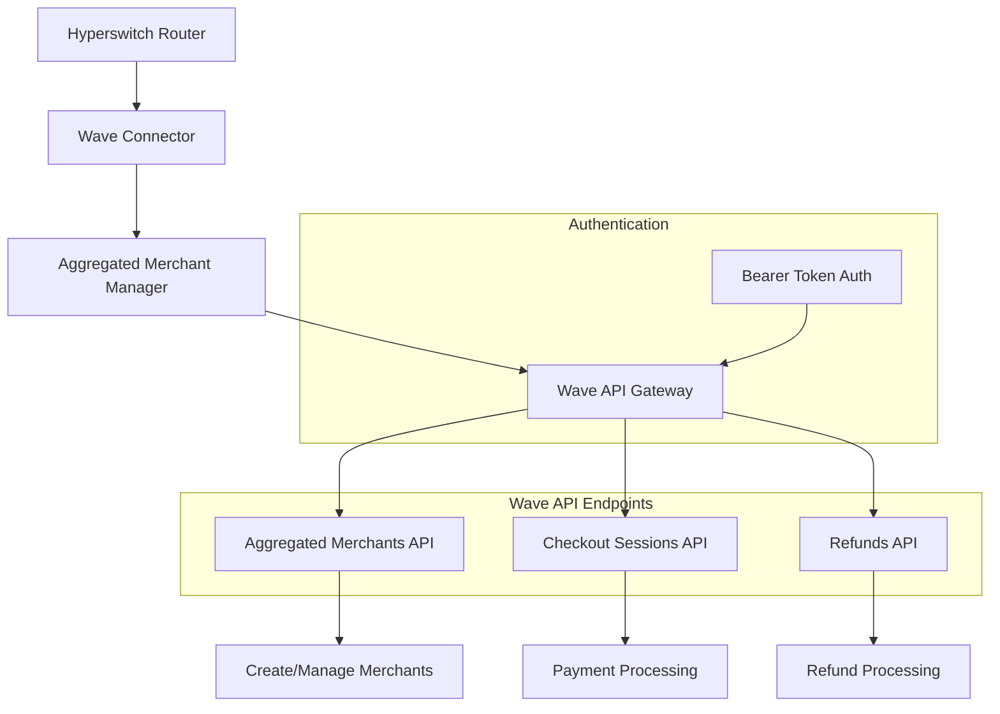
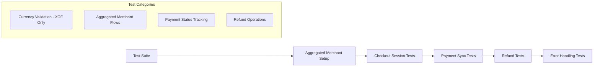

# History Memo - 2025-09-10

## [15:34:52] - MAGUS Council → gemini
Source docs wave
https://docs.wave.com/aggregated-merchants#aggregated-merchants-api
https://docs.wave.com/checkout#checkout-api
https://docs.wave.com/payout#payout-api

sources hyperswitch
https://github.com/juspay/hyperswitch/blob/main/add_connector.md#integrate-a-new-connector
https://deepwiki.com/juspay/hyperswitch/6-connector-integrations
https://docs.hyperswitch.io/explore-hyperswitch/payment-orchestration/quickstart/payment-methods-setup
https://docs.hyperswitch.io/explore-hyperswitch/payment-orchestration


Peux tu reprendre les tests from scrash et les adaptes a la doc de wave 
currency support: XOF (only)

resultat Precedent test : (plus applicable) 
cargo test -p router --test connectors -- wave -- --nocapture --test-threads 1 -j 2

   Compiling router v0.2.0 (/home/pdiaw/hyperswitch/crates/router)

    Finished `test` profile [unoptimized + debuginfo] target(s) in 2m 17s

     Running tests/connectors/main.rs (target/debug/deps/connectors-9620bf4622b1445c)


running 10 tests

test wave::should_fail_payment_for_invalid_currency ... ok

test wave::should_fail_payment_for_invalid_amount ... ok

test wave::should_authorize_payment_with_usd ... FAILED

test wave::should_refund_succeeded_payment ... FAILED

test wave::should_sync_authorized_payment ... FAILED

test wave::should_sync_refund ... FAILED

test wave::should_only_authorize_payment ... FAILED

test wave::should_void_authorized_payment ... FAILED

test wave::wave_smoke_health ... ok

test wave::wave_attach_connector_and_check ... FAILED


failures:


---- wave::should_authorize_payment_with_usd stdout ----


thread 'wave::should_authorize_payment_with_usd' panicked at crates/router/tests/connectors/wave.rs:157:10:

called `Result::unwrap()` on an `Err` value: Failed to execute a processing step: None

├╴at crates/router/src/services/api.rs:483:43

│

╰─▶ Unexpected state reached/Invariants conflicted

    ╰╴at crates/router/src/services/api/client.rs:251:45


---- wave::should_refund_succeeded_payment stdout ----


thread 'wave::should_refund_succeeded_payment' panicked at crates/router/tests/connectors/wave.rs:226:10:

called `Result::unwrap()` on an `Err` value: Failed to execute a processing step: None

├╴at crates/router/src/services/api.rs:483:43

│

╰─▶ Unexpected state reached/Invariants conflicted

    ╰╴at crates/router/src/services/api/client.rs:251:45


---- wave::should_sync_authorized_payment stdout ----


thread 'wave::should_sync_authorized_payment' panicked at crates/router/tests/connectors/wave.rs:175:10:

called `Result::unwrap()` on an `Err` value: Failed to execute a processing step: None

├╴at crates/router/src/services/api.rs:483:43

│

╰─▶ Unexpected state reached/Invariants conflicted

    ╰╴at crates/router/src/services/api/client.rs:251:45


---- wave::should_sync_refund stdout ----


thread 'wave::should_sync_refund' panicked at crates/router/tests/connectors/wave.rs:257:10:

called `Result::unwrap()` on an `Err` value: Failed to execute a processing step: None

├╴at crates/router/src/services/api.rs:483:43

│

╰─▶ Unexpected state reached/Invariants conflicted

    ╰╴at crates/router/src/services/api/client.rs:251:45


---- wave::should_only_authorize_payment stdout ----


thread 'wave::should_only_authorize_payment' panicked at crates/router/tests/connectors/wave.rs:139:10:

called `Result::unwrap()` on an `Err` value: Failed to execute a processing step: None

├╴at crates/router/src/services/api.rs:483:43

│

╰─▶ Unexpected state reached/Invariants conflicted

    ╰╴at crates/router/src/services/api/client.rs:251:45


---- wave::should_void_authorized_payment stdout ----


thread 'wave::should_void_authorized_payment' panicked at crates/router/tests/connectors/utils.rs:260:14:

called `Result::unwrap()` on an `Err` value: Failed to execute a processing step: None

├╴at crates/router/src/services/api.rs:483:43

│

╰─▶ Unexpected state reached/Invariants conflicted

    ╰╴at crates/router/src/services/api/client.rs:251:45

note: run with `RUST_BACKTRACE=1` environment variable to display a backtrace


---- wave::wave_attach_connector_and_check stdout ----


thread 'wave::wave_attach_connector_and_check' panicked at /root/.cargo/registry/src/index.crates.io-1949cf8c6b5b557f/actix-web-4.11.0/src/test/test_utils.rs:328:49:

called `Result::unwrap()` on an `Err` value: Error("missing field `merchant_id`", line: 1, column: 171)


failures:

    wave::should_authorize_payment_with_usd

    wave::should_only_authorize_payment

    wave::should_refund_succeeded_payment

    wave::should_sync_authorized_payment

    wave::should_sync_refund

    wave::should_void_authorized_payment

    wave::wave_attach_connector_and_check


test result: FAILED. 3 passed; 7 failed; 0 ignored; 0 measured; 1942 filtered out; finished in 2.01s


error: test failed, to rerun pass `-p router --test connectors`

Open files:
.qoder/quests/wave-connector-implementation-1757426345.md

## [15:35:11] - MAGUS Council → gemini
Source docs wave
https://docs.wave.com/aggregated-merchants#aggregated-merchants-api
https://docs.wave.com/checkout#checkout-api
https://docs.wave.com/payout#payout-api

sources hyperswitch
https://github.com/juspay/hyperswitch/blob/main/add_connector.md#integrate-a-new-connector
https://deepwiki.com/juspay/hyperswitch/6-connector-integrations
https://docs.hyperswitch.io/explore-hyperswitch/payment-orchestration/quickstart/payment-methods-setup
https://docs.hyperswitch.io/explore-hyperswitch/payment-orchestration


Peux tu reprendre les tests from scrash et les adaptes a la doc de wave 
currency support: XOF (only)

resultat Precedent test : (plus applicable) 
cargo test -p router --test connectors -- wave -- --nocapture --test-threads 1 -j 2

   Compiling router v0.2.0 (/home/pdiaw/hyperswitch/crates/router)

    Finished `test` profile [unoptimized + debuginfo] target(s) in 2m 17s

     Running tests/connectors/main.rs (target/debug/deps/connectors-9620bf4622b1445c)


running 10 tests

test wave::should_fail_payment_for_invalid_currency ... ok

test wave::should_fail_payment_for_invalid_amount ... ok

test wave::should_authorize_payment_with_usd ... FAILED

test wave::should_refund_succeeded_payment ... FAILED

test wave::should_sync_authorized_payment ... FAILED

test wave::should_sync_refund ... FAILED

test wave::should_only_authorize_payment ... FAILED

test wave::should_void_authorized_payment ... FAILED

test wave::wave_smoke_health ... ok

test wave::wave_attach_connector_and_check ... FAILED


failures:


---- wave::should_authorize_payment_with_usd stdout ----


thread 'wave::should_authorize_payment_with_usd' panicked at crates/router/tests/connectors/wave.rs:157:10:

called `Result::unwrap()` on an `Err` value: Failed to execute a processing step: None

├╴at crates/router/src/services/api.rs:483:43

│

╰─▶ Unexpected state reached/Invariants conflicted

    ╰╴at crates/router/src/services/api/client.rs:251:45


---- wave::should_refund_succeeded_payment stdout ----


thread 'wave::should_refund_succeeded_payment' panicked at crates/router/tests/connectors/wave.rs:226:10:

called `Result::unwrap()` on an `Err` value: Failed to execute a processing step: None

├╴at crates/router/src/services/api.rs:483:43

│

╰─▶ Unexpected state reached/Invariants conflicted

    ╰╴at crates/router/src/services/api/client.rs:251:45


---- wave::should_sync_authorized_payment stdout ----


thread 'wave::should_sync_authorized_payment' panicked at crates/router/tests/connectors/wave.rs:175:10:

called `Result::unwrap()` on an `Err` value: Failed to execute a processing step: None

├╴at crates/router/src/services/api.rs:483:43

│

╰─▶ Unexpected state reached/Invariants conflicted

    ╰╴at crates/router/src/services/api/client.rs:251:45


---- wave::should_sync_refund stdout ----


thread 'wave::should_sync_refund' panicked at crates/router/tests/connectors/wave.rs:257:10:

called `Result::unwrap()` on an `Err` value: Failed to execute a processing step: None

├╴at crates/router/src/services/api.rs:483:43

│

╰─▶ Unexpected state reached/Invariants conflicted

    ╰╴at crates/router/src/services/api/client.rs:251:45


---- wave::should_only_authorize_payment stdout ----


thread 'wave::should_only_authorize_payment' panicked at crates/router/tests/connectors/wave.rs:139:10:

called `Result::unwrap()` on an `Err` value: Failed to execute a processing step: None

├╴at crates/router/src/services/api.rs:483:43

│

╰─▶ Unexpected state reached/Invariants conflicted

    ╰╴at crates/router/src/services/api/client.rs:251:45


---- wave::should_void_authorized_payment stdout ----


thread 'wave::should_void_authorized_payment' panicked at crates/router/tests/connectors/utils.rs:260:14:

called `Result::unwrap()` on an `Err` value: Failed to execute a processing step: None

├╴at crates/router/src/services/api.rs:483:43

│

╰─▶ Unexpected state reached/Invariants conflicted

    ╰╴at crates/router/src/services/api/client.rs:251:45

note: run with `RUST_BACKTRACE=1` environment variable to display a backtrace


---- wave::wave_attach_connector_and_check stdout ----


thread 'wave::wave_attach_connector_and_check' panicked at /root/.cargo/registry/src/index.crates.io-1949cf8c6b5b557f/actix-web-4.11.0/src/test/test_utils.rs:328:49:

called `Result::unwrap()` on an `Err` value: Error("missing field `merchant_id`", line: 1, column: 171)


failures:

    wave::should_authorize_payment_with_usd

    wave::should_only_authorize_payment

    wave::should_refund_succeeded_payment

    wave::should_sync_authorized_payment

    wave::should_sync_refund

    wave::should_void_authorized_payment

    wave::wave_attach_connector_and_check


test result: FAILED. 3 passed; 7 failed; 0 ignored; 0 measured; 1942 filtered out; finished in 2.01s


error: test failed, to rerun pass `-p router --test connectors`

Open files:
.qoder/quests/wave-connector-implementation-1757426345.md

## [16:20:32] - MAGUS Council → gemini
Source docs wave
https://docs.wave.com/aggregated-merchants#aggregated-merchants-api
https://docs.wave.com/checkout#checkout-api
https://docs.wave.com/payout#payout-api

sources hyperswitch
https://github.com/juspay/hyperswitch/blob/main/add_connector.md#integrate-a-new-connector
https://deepwiki.com/juspay/hyperswitch/6-connector-integrations
https://docs.hyperswitch.io/explore-hyperswitch/payment-orchestration/quickstart/payment-methods-setup
https://docs.hyperswitch.io/explore-hyperswitch/payment-orchestration


Peux tu reprendre les tests from scrash et les adaptes a la doc de wave 
currency support: XOF (only)

resultat Precedent test : (plus applicable) 
cargo test -p router --test connectors -- wave -- --nocapture --test-threads 1 -j 2

   Compiling router v0.2.0 (/home/pdiaw/hyperswitch/crates/router)

    Finished `test` profile [unoptimized + debuginfo] target(s) in 2m 17s

     Running tests/connectors/main.rs (target/debug/deps/connectors-9620bf4622b1445c)


running 10 tests

test wave::should_fail_payment_for_invalid_currency ... ok

test wave::should_fail_payment_for_invalid_amount ... ok

test wave::should_authorize_payment_with_usd ... FAILED

test wave::should_refund_succeeded_payment ... FAILED

test wave::should_sync_authorized_payment ... FAILED

test wave::should_sync_refund ... FAILED

test wave::should_only_authorize_payment ... FAILED

test wave::should_void_authorized_payment ... FAILED

test wave::wave_smoke_health ... ok

test wave::wave_attach_connector_and_check ... FAILED


failures:


---- wave::should_authorize_payment_with_usd stdout ----


thread 'wave::should_authorize_payment_with_usd' panicked at crates/router/tests/connectors/wave.rs:157:10:

called `Result::unwrap()` on an `Err` value: Failed to execute a processing step: None

├╴at crates/router/src/services/api.rs:483:43

│

╰─▶ Unexpected state reached/Invariants conflicted

    ╰╴at crates/router/src/services/api/client.rs:251:45


---- wave::should_refund_succeeded_payment stdout ----


thread 'wave::should_refund_succeeded_payment' panicked at crates/router/tests/connectors/wave.rs:226:10:

called `Result::unwrap()` on an `Err` value: Failed to execute a processing step: None

├╴at crates/router/src/services/api.rs:483:43

│

╰─▶ Unexpected state reached/Invariants conflicted

    ╰╴at crates/router/src/services/api/client.rs:251:45


---- wave::should_sync_authorized_payment stdout ----


thread 'wave::should_sync_authorized_payment' panicked at crates/router/tests/connectors/wave.rs:175:10:

called `Result::unwrap()` on an `Err` value: Failed to execute a processing step: None

├╴at crates/router/src/services/api.rs:483:43

│

╰─▶ Unexpected state reached/Invariants conflicted

    ╰╴at crates/router/src/services/api/client.rs:251:45


---- wave::should_sync_refund stdout ----


thread 'wave::should_sync_refund' panicked at crates/router/tests/connectors/wave.rs:257:10:

called `Result::unwrap()` on an `Err` value: Failed to execute a processing step: None

├╴at crates/router/src/services/api.rs:483:43

│

╰─▶ Unexpected state reached/Invariants conflicted

    ╰╴at crates/router/src/services/api/client.rs:251:45


---- wave::should_only_authorize_payment stdout ----


thread 'wave::should_only_authorize_payment' panicked at crates/router/tests/connectors/wave.rs:139:10:

called `Result::unwrap()` on an `Err` value: Failed to execute a processing step: None

├╴at crates/router/src/services/api.rs:483:43

│

╰─▶ Unexpected state reached/Invariants conflicted

    ╰╴at crates/router/src/services/api/client.rs:251:45


---- wave::should_void_authorized_payment stdout ----


thread 'wave::should_void_authorized_payment' panicked at crates/router/tests/connectors/utils.rs:260:14:

called `Result::unwrap()` on an `Err` value: Failed to execute a processing step: None

├╴at crates/router/src/services/api.rs:483:43

│

╰─▶ Unexpected state reached/Invariants conflicted

    ╰╴at crates/router/src/services/api/client.rs:251:45

note: run with `RUST_BACKTRACE=1` environment variable to display a backtrace


---- wave::wave_attach_connector_and_check stdout ----


thread 'wave::wave_attach_connector_and_check' panicked at /root/.cargo/registry/src/index.crates.io-1949cf8c6b5b557f/actix-web-4.11.0/src/test/test_utils.rs:328:49:

called `Result::unwrap()` on an `Err` value: Error("missing field `merchant_id`", line: 1, column: 171)


failures:

    wave::should_authorize_payment_with_usd

    wave::should_only_authorize_payment

    wave::should_refund_succeeded_payment

    wave::should_sync_authorized_payment

    wave::should_sync_refund

    wave::should_void_authorized_payment

    wave::wave_attach_connector_and_check


test result: FAILED. 3 passed; 7 failed; 0 ignored; 0 measured; 1942 filtered out; finished in 2.01s


error: test failed, to rerun pass `-p router --test connectors`

Open files:
package.json
cypress-tests-v2/package.json
cypress-tests/package.json

## [17:04:09] - MAGUS Council → gemini
test

Open files:
.qoder/quests/test-wave-api-with-xof-currency.md
.qoder/quests/wave-test-adaptation.md

## [17:04:48] - MAGUS Council → gemini
test

Open files:
.qoder/quests/test-wave-api-with-xof-currency.md
.qoder/quests/wave-test-adaptation.md

## [17:08:20] - MAGUS Council → gemini
test

Open files:
.qoder/quests/test-wave-api-with-xof-currency.md
.qoder/quests/wave-test-adaptation.md

## [17:08:35] - MAGUS Council → gemini
test

Open files:
.qoder/quests/test-wave-api-with-xof-currency.md
.qoder/quests/wave-test-adaptation.md

## [17:08:40] - MAGUS Council → gemini
test

## [17:09:10] - MAGUS Council → gemini
test

## [17:09:23] - MAGUS Council → codex
test

## [17:09:27] - MAGUS Council → gemini, codex
test

## [17:09:32] - MAGUS Council → gemini
test

## [17:10:26] - MAGUS Council → gemini
test

## [17:15:07] - MAGUS Council → gemini
test

## [17:17:05] - MAGUS Council → gemini
# Wave Connector Test Adaptation Design

## Overview

This design document outlines the adaptation of Wave connector tests to support the Wave Aggregated Merchants API with proper XOF currency support. The current tests are failing due to missing implementation of aggregated merchant functionality and improper API endpoint configuration.

## Repository Analysis

**Repository Type**: Backend Application - Payment Orchestration Platform
**Framework**: Rust-based microservices with Hyperswitch connector architecture
**Focus**: Connector integration testing for payment processing

## Current Issues Analysis

### Test Failures Root Cause
```
Failed to execute a processing step: None
├╴at crates/router/src/services/api.rs:483:43
│
╰─▶ Unexpected state reached/Invariants conflicted
    ╰╴at crates/router/src/services/api/client.rs:251:45
```

**Primary Issues:**
1. Wave API endpoints not properly configured for aggregated merchants
2. Missing aggregated merchant ID parameter in checkout session creation
3. Currency validation not enforcing XOF-only support
4. Authentication header format mismatch
5. Test data structure incompatible with Wave's aggregated merchant model

## Architecture

### Wave Aggregated Merchants Integration



### Enhanced Test Architecture



## API Endpoints Reference

### Updated Wave Connector Endpoints
| Endpoint | Method | Purpose | Aggregated Merchant Support |
|----------|--------|---------|------------------------------|
| `/v1/aggregated_merchants` | GET | List merchants | ✅ |
| `/v1/aggregated_merchants` | POST | Create merchant | ✅ |
| `/v1/checkout/sessions` | POST | Create session | ✅ (via `aggregated_merchant_id`) |
| `/v1/checkout/sessions/{id}` | GET | Session status | ✅ |
| `/v1/checkout/sessions/{id}/expire` | POST | Cancel session | ✅ |
| `/v1/checkout/sessions/{id}/refund` | POST | Refund payment | ✅ |

## Data Models & ORM Mapping

### Enhanced Wave Request/Response Types

```rust
// Aggregated Merchant Management
pub struct WaveAggregatedMerchantRequest {
    pub name: String,
    pub business_type: WaveBusinessType,
    pub business_description: String,
    pub website_url: Option<String>,
    pub manager_name: Option<String>,
}

pub struct WaveAggregatedMerchantResponse {
    pub id: String,
    pub name: String,
    pub business_type: WaveBusinessType,
    pub payout_fee_structure_name: String,
    pub checkout_fee_structure_name: String,
    pub is_locked: bool,
    pub when_created: String,
}

// Enhanced Checkout Session with Aggregated Merchant Support
pub struct WaveCheckoutSessionRequest {
    pub amount: String,
    pub currency: String, // XOF only
    pub aggregated_merchant_id: Option<String>,
    pub error_url: Option<String>,
    pub success_url: Option<String>,
    pub client_reference: Option<String>,
}
```

### XOF Currency Validation

```rust
impl CurrencyValidation for Wave {
    fn validate_currency(currency: Currency) -> Result<(), ConnectorError> {
        match currency {
            Currency::XOF => Ok(()),
            _ => Err(ConnectorError::InvalidCurrency {
                supported_currencies: vec![Currency::XOF],
                provided_currency: currency,
            }),
        }
    }
}
```

## Business Logic Layer

### Aggregated Merchant Manager

```rust
pub struct AggregatedMerchantManager {
    connector: Wave,
    merchant_cache: HashMap<String, WaveAggregatedMerchantResponse>,
}

impl AggregatedMerchantManager {
    pub async fn ensure_test_merchant(&mut self) -> Result<String, ConnectorError> {
        // Check cache first
        if let Some(merchant) = self.get_test_merchant_from_cache() {
            return Ok(merchant.id);
        }
        
        // Create test merchant for testing
        let request = WaveAggregatedMerchantRequest {
            name: format!("Test-Merchant-{}", generate_unique_id()),
            business_type: WaveBusinessType::Other,
            business_description: "Test merchant for Hyperswitch integration".to_string(),
            website_url: Some("https://test.hyperswitch.io".to_string()),
            manager_name: Some("Test Manager".to_string()),
        };
        
        let merchant = self.connector.create_aggregated_merchant(request).await?;
        self.merchant_cache.insert(merchant.id.clone(), merchant.clone());
        Ok(merchant.id)
    }
}
```

### Enhanced Payment Flow Integration

```rust
impl PaymentFlowWithAggregatedMerchant for Wave {
    async fn authorize_with_merchant(
        &self,
        payment_data: PaymentsAuthorizeData,
        merchant_id: Option<String>,
    ) -> Result<PaymentsAuthorizeRouterData, ConnectorError> {
        // Validate XOF currency
        Self::validate_currency(payment_data.currency)?;
        
        // Build request with aggregated merchant
        let mut session_request = WaveCheckoutSessionRequest::try_from(&payment_data)?;
        session_request.aggregated_merchant_id = merchant_id;
        
        // Create checkout session
        self.create_checkout_session(session_request).await
    }
}
```

## Testing Strategy

### Test Structure Redesign

```rust
// Base test configuration
struct WaveTestConfig {
    aggregated_merchant_manager: AggregatedMerchantManager,
    test_merchant_id: String,
}

impl WaveTestConfig {
    async fn setup() -> Result<Self, TestError> {
        let mut manager = AggregatedMerchantManager::new();
        let merchant_id = manager.ensure_test_merchant().await?;
        
        Ok(Self {
            aggregated_merchant_manager: manager,
            test_merchant_id: merchant_id,
        })
    }
}
```

### Updated Test Cases

#### 1. Aggregated Merchant Setup Tests
```rust
#[actix_web::test]
async fn should_create_test_aggregated_merchant() {
    let config = WaveTestConfig::setup().await.unwrap();
    assert!(!config.test_merchant_id.is_empty());
    assert!(config.test_merchant_id.starts_with("am-"));
}

#[actix_web::test] 
async fn should_list_aggregated_merchants() {
    let connector = Wave::new();
    let merchants = connector.list_aggregated_merchants().await.unwrap();
    assert!(!merchants.items.is_empty());
}
```

#### 2. XOF Currency Validation Tests
```rust
#[actix_web::test]
async fn should_authorize_payment_xof_only() {
    let config = WaveTestConfig::setup().await.unwrap();
    let payment_data = get_xof_payment_data(config.test_merchant_id.clone());
    
    let response = Wave::new()
        .authorize_payment(Some(payment_data), None)
        .await
        .unwrap();
    
    assert_eq!(response.status, AttemptStatus::Pending);
    assert!(response.response.unwrap().get_redirection_data().is_some());
}

#[actix_web::test]
async fn should_reject_non_xof_currency() {
    let payment_data = get_usd_payment_data(); // Should fail
    
    let result = Wave::new()
        .authorize_payment(Some(payment_data), None)
        .await;
    
    assert!(result.is_err());
    let error = result.unwrap_err();
    assert!(error.to_string().contains("XOF"));
}
```

#### 3. Enhanced Payment Flow Tests
```rust
#[actix_web::test]
async fn should_complete_aggregated_merchant_payment_flow() {
    let config = WaveTestConfig::setup().await.unwrap();
    let connector = Wave::new();
    
    // Create checkout session with aggregated merchant
    let payment_data = get_xof_payment_data_with_merchant(config.test_merchant_id);
    let auth_response = connector
        .authorize_payment(Some(payment_data), None)
        .await
        .unwrap();
    
    // Verify session created with proper merchant context
    assert_eq!(auth_response.status, AttemptStatus::Pending);
    
    let session_id = get_connector_transaction_id(auth_response.response).unwrap();
    
    // Check session status
    let sync_response = connector
        .psync_retry_till_status_matches(
            AttemptStatus::Pending,
            Some(PaymentsSyncData {
                connector_transaction_id: ResponseId::ConnectorTransactionId(session_id),
                ..Default::default()
            }),
            None,
        )
        .await
        .unwrap();
    
    assert!(matches!(
        sync_response.status,
        AttemptStatus::Pending | AttemptStatus::Charged | AttemptStatus::Failure
    ));
}
```

#### 4. Refund Tests with Merchant Context
```rust
#[actix_web::test]
async fn should_refund_aggregated_merchant_payment() {
    let config = WaveTestConfig::setup().await.unwrap();
    let connector = Wave::new();
    
    // Create and complete payment first
    let payment_data = get_xof_payment_data_with_merchant(config.test_merchant_id);
    let auth_response = connector
        .authorize_payment(Some(payment_data), None)
        .await
        .unwrap();
    
    let session_id = get_connector_transaction_id(auth_response.response).unwrap();
    
    // Create refund
    let refund_response = connector
        .refund_payment(
            session_id,
            Some(RefundsData {
                refund_amount: 500,
                reason: Some("test_refund".to_string()),
                ..PaymentRefundType::default().0
            }),
            None,
        )
        .await
        .unwrap();
    
    assert!(matches!(
        refund_response.response.unwrap().refund_status,
        RefundStatus::Pending | RefundStatus::Success
    ));
}
```

### Test Data Helpers

```rust
fn get_xof_payment_data_with_merchant(merchant_id: String) -> PaymentsAuthorizeData {
    PaymentsAuthorizeData {
        payment_method_data: PaymentMethodData::Wallet(
            WalletData::MobilePayRedirect(Box::new(MobilePayRedirection {}))
        ),
        currency: Currency::XOF,
        amount: 1000,
        minor_amount: MinorUnit::new(1000),
        email: Some(Email::from_str("test@wave.com").unwrap()),
        customer_name: Some(Secret::new("Test Customer".to_string())),
        router_return_url: Some("https://test.hyperswitch.io/return".to_string()),
        connector_metadata: Some(serde_json::json!({
            "aggregated_merchant_id": merchant_id
        })),
        ..PaymentAuthorizeType::default().0
    }
}

fn get_usd_payment_data() -> PaymentsAuthorizeData {
    PaymentsAuthorizeData {
        currency: Currency::USD, // This should trigger validation error
        ..get_xof_payment_data_with_merchant("test".to_string())
    }
}
```

## Implementation Roadmap

### Phase 1: Core Infrastructure
1. **Aggregated Merchant API Integration**
   - Implement aggregated merchant CRUD operations
   - Add merchant ID parameter to checkout session requests
   - Update authentication headers for Bearer token format

2. **Currency Validation Enhancement**
   - Enforce XOF-only validation in connector
   - Update error handling for unsupported currencies
   - Add proper error messages for currency mismatches

### Phase 2: Test Framework Updates
1. **Test Configuration Setup**
   - Implement WaveTestConfig with merchant management
   - Add aggregated merchant setup/teardown logic
   - Create reusable test data builders

2. **Test Case Adaptation**
   - Update existing tests to use aggregated merchants
   - Add XOF currency validation tests
   - Enhance error handling test coverage

### Phase 3: Enhanced Testing
1. **Payment Flow Integration**
   - Test complete payment flows with aggregated merchants
   - Validate proper fee structure application
   - Test merchant-specific payment behaviors

2. **Webhook Integration Testing**
   - Test webhook handling for aggregated merchant payments
   - Validate merchant context in webhook payloads
   - Add webhook verification tests

## Error Handling Improvements

### Currency Validation Errors
```rust
pub enum WaveCurrencyError {
    UnsupportedCurrency {
        provided: Currency,
        supported: Vec<Currency>,
    },
    InvalidAmount {
        currency: Currency,
        amount: MinorUnit,
        reason: String,
    },
}
```

### Aggregated Merchant Errors
```rust
pub enum WaveAggregatedMerchantError {
    MerchantNotFound { merchant_id: String },
    MerchantCreationFailed { reason: String },
    MerchantLocked { merchant_id: String },
    InvalidBusinessType { provided: String },
}
```

## Validation & Testing Checklist

### Pre-Test Validation
- [ ] Wave API credentials properly configured
- [ ] Test aggregated merchant created successfully
- [ ] XOF currency validation working
- [ ] Bearer token authentication configured

### Test Execution Validation
- [ ] All currency validation tests pass
- [ ] Aggregated merchant setup/teardown works
- [ ] Payment authorization with merchant context succeeds
- [ ] Payment sync operations work correctly
- [ ] Refund operations with merchant context succeed
- [ ] Error handling tests cover edge cases

### Post-Test Validation
- [ ] Test merchants cleaned up properly
- [ ] No orphaned checkout sessions remain
- [ ] API rate limits not exceeded
- [ ] All test data properly isolated

cargo test -p router --test connectors -- wave -- --nocapture --test-threads 1 -j 2
error[E0407]: method `validate_capture_method` is not a member of trait `ConnectorValidation`
   --> crates/hyperswitch_connectors/src/connectors/wave.rs:158:5
    |
158 | /     fn validate_capture_method(
159 | |         &self,
160 | |         capture_method: Option<hyperswitch_domain_models::payment_method_data::enums::CaptureMethod>,
161 | |         _pmt: Option<hyperswitch_domain_models::payment_method_data::enums::PaymentMethodType>,
...   |
176 | |     }
    | |_____^ not a member of trait `ConnectorValidation`

error[E0433]: failed to resolve: could not find `enums` in `payment_method_data`
   --> crates/hyperswitch_connectors/src/connectors/wave.rs:160:80
    |
160 |         capture_method: Option<hyperswitch_domain_models::payment_method_data::enums::CaptureMethod>,
    |                                                                                ^^^^^ could not find `enums` in `payment_method_data`
    |
help: consider importing one of these modules
    |
3   + use api_models::enums;
    |
3   + use api_models::enums::enums;
    |
3   + use common_enums::enums;
    |
3   + use hyperswitch_domain_models::payment_methods::storage_enums::enums;
    |
help: if you import `enums`, refer to it directly
    |
160 -         capture_method: Option<hyperswitch_domain_models::payment_method_data::enums::CaptureMethod>,
160 +         capture_method: Option<enums::CaptureMethod>,
    |

error[E0433]: failed to resolve: could not find `enums` in `payment_method_data`
   --> crates/hyperswitch_connectors/src/connectors/wave.rs:161:70
    |
161 |         _pmt: Option<hyperswitch_domain_models::payment_method_data::enums::PaymentMethodType>,
    |                                                                      ^^^^^ could not find `enums` in `payment_method_data`
    |
help: consider importing one of these modules
    |
3   + use api_models::enums;
    |
3   + use api_models::enums::enums;
    |
3   + use common_enums::enums;
    |
3   + use hyperswitch_domain_models::payment_methods::storage_enums::enums;
    |
help: if you import `enums`, refer to it directly
    |
161 -         _pmt: Option<hyperswitch_domain_models::payment_method_data::enums::PaymentMethodType>,
161 +         _pmt: Option<enums::PaymentMethodType>,
    |

error[E0433]: failed to resolve: could not find `enums` in `payment_method_data`
   --> crates/hyperswitch_connectors/src/connectors/wave.rs:165:61
    |
165 |             hyperswitch_domain_models::payment_method_data::enums::CaptureMethod::Automatic => Ok(()),
    |                                                             ^^^^^ could not find `enums` in `payment_method_data`
    |
help: consider importing one of these enums
    |
3   + use api_models::enums::CaptureMethod;
    |
3   + use common_enums::CaptureMethod;
    |
3   + use hyperswitch_domain_models::payment_methods::storage_enums::CaptureMethod;
    |
help: if you import `CaptureMethod`, refer to it directly
    |
165 -             hyperswitch_domain_models::payment_method_data::enums::CaptureMethod::Automatic => Ok(()),
165 +             CaptureMethod::Automatic => Ok(()),
    |

error[E0433]: failed to resolve: could not find `enums` in `payment_method_data`
   --> crates/hyperswitch_connectors/src/connectors/wave.rs:166:61
    |
166 |             hyperswitch_domain_models::payment_method_data::enums::CaptureMethod::Manual
    |                                                             ^^^^^ could not find `enums` in `payment_method_data`
    |
help: consider importing one of these enums
    |
3   + use api_models::enums::CaptureMethod;
    |
3   + use common_enums::CaptureMethod;
    |
3   + use hyperswitch_domain_models::payment_methods::storage_enums::CaptureMethod;
    |
help: if you import `CaptureMethod`, refer to it directly
    |
166 -             hyperswitch_domain_models::payment_method_data::enums::CaptureMethod::Manual
166 +             CaptureMethod::Manual
    |

error[E0433]: failed to resolve: could not find `enums` in `payment_method_data`
   --> crates/hyperswitch_connectors/src/connectors/wave.rs:167:63
    |
167 |             | hyperswitch_domain_models::payment_method_data::enums::CaptureMethod::ManualMultiple
    |                                                               ^^^^^ could not find `enums` in `payment_method_data`
    |
help: consider importing one of these enums
    |
3   + use api_models::enums::CaptureMethod;
    |
3   + use common_enums::CaptureMethod;
    |
3   + use hyperswitch_domain_models::payment_methods::storage_enums::CaptureMethod;
    |
help: if you import `CaptureMethod`, refer to it directly
    |
167 -             | hyperswitch_domain_models::payment_method_data::enums::CaptureMethod::ManualMultiple
167 +             | CaptureMethod::ManualMultiple
    |

error[E0433]: failed to resolve: could not find `enums` in `payment_method_data`
   --> crates/hyperswitch_connectors/src/connectors/wave.rs:168:63
    |
168 |             | hyperswitch_domain_models::payment_method_data::enums::CaptureMethod::Scheduled => {
    |                                                               ^^^^^ could not find `enums` in `payment_method_data`
    |
help: consider importing one of these enums
    |
3   + use api_models::enums::CaptureMethod;
    |
3   + use common_enums::CaptureMethod;
    |
3   + use hyperswitch_domain_models::payment_methods::storage_enums::CaptureMethod;
    |
help: if you import `CaptureMethod`, refer to it directly
    |
168 -             | hyperswitch_domain_models::payment_method_data::enums::CaptureMethod::Scheduled => {
168 +             | CaptureMethod::Scheduled => {
    |

warning: unused import: `error_stack::ResultExt`
  --> crates/hyperswitch_connectors/src/connectors/wave/transformers.rs:23:5
   |
23 | use error_stack::ResultExt;
   |     ^^^^^^^^^^^^^^^^^^^^^^
   |
   = note: `#[warn(unused_imports)]` on by default

warning: unused import: `AddressDetailsData`
  --> crates/hyperswitch_connectors/src/connectors/wave/transformers.rs:27:74
   |
27 |     utils::{PaymentsAuthorizeRequestData, RouterData as UtilsRouterData, AddressDetailsData},
   |                                                                          ^^^^^^^^^^^^^^^^^^

warning: unused variable: `request`
  --> crates/hyperswitch_connectors/src/connectors/wave.rs:71:13
   |
71 |         let request = RequestBuilder::new()
   |             ^^^^^^^ help: if this is intentional, prefix it with an underscore: `_request`
   |
   = note: `#[warn(unused_variables)]` on by default

warning: unused variable: `request`
  --> crates/hyperswitch_connectors/src/connectors/wave.rs:90:13
   |
90 |         let request = RequestBuilder::new()
   |             ^^^^^^^ help: if this is intentional, prefix it with an underscore: `_request`

   Compiling scheduler v0.1.0 (/home/pdiaw/hyperswitch/crates/scheduler)
   Compiling analytics v0.1.0 (/home/pdiaw/hyperswitch/crates/analytics)
error[E0599]: no method named `get` found for reference `&Secret<serde_json::Value>` in the current scope
   --> crates/hyperswitch_connectors/src/connectors/wave/transformers.rs:155:43
    |
155 |             .and_then(|metadata| metadata.get("aggregated_merchant_id"))
    |                                           ^^^ method not found in `&Secret<serde_json::Value>`

   Compiling payment_methods v0.1.0 (/home/pdiaw/hyperswitch/crates/payment_methods)
warning: unused variable: `error_message`
   --> crates/hyperswitch_connectors/src/connectors/wave/transformers.rs:311:13
    |
311 |         let error_message = error_response.message;
    |             ^^^^^^^^^^^^^ help: if this is intentional, prefix it with an underscore: `_error_message`

Some errors have detailed explanations: E0407, E0433, E0599.
For more information about an error, try `rustc --explain E0407`.
warning: `hyperswitch_connectors` (lib) generated 5 warnings
error: could not compile `hyperswitch_connectors` (lib) due to 8 previous errors; 5 warnings emitted
