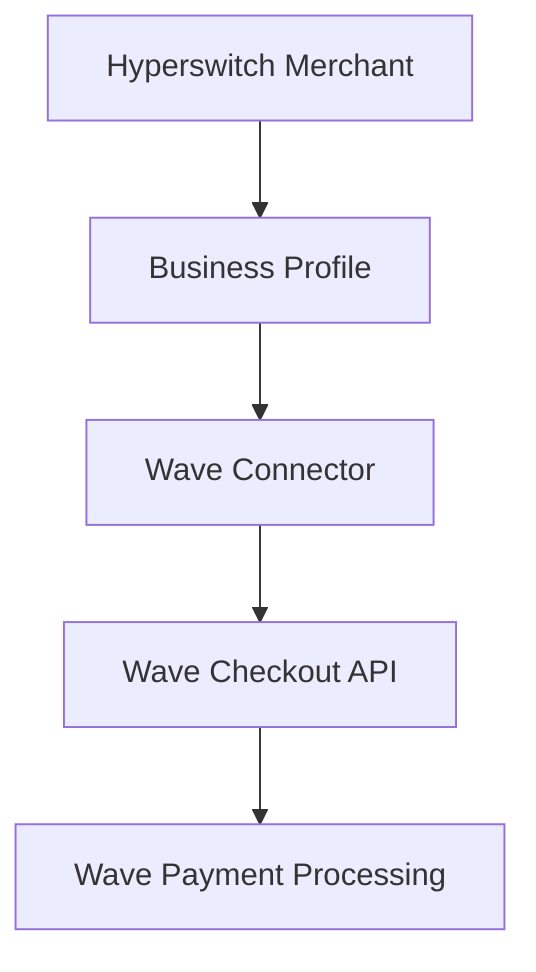
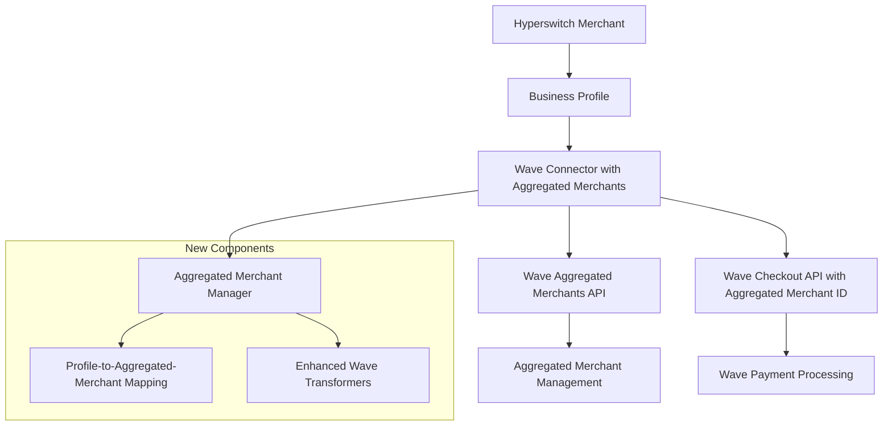
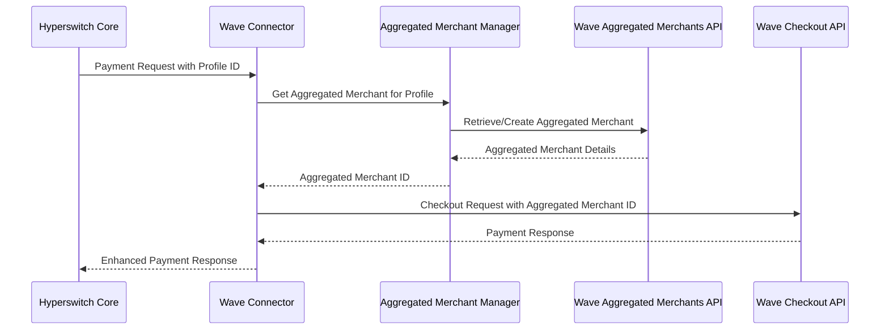
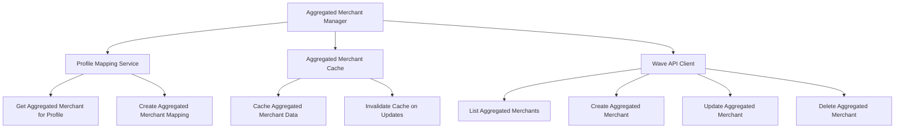
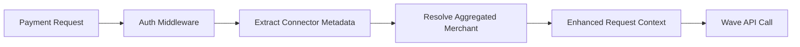
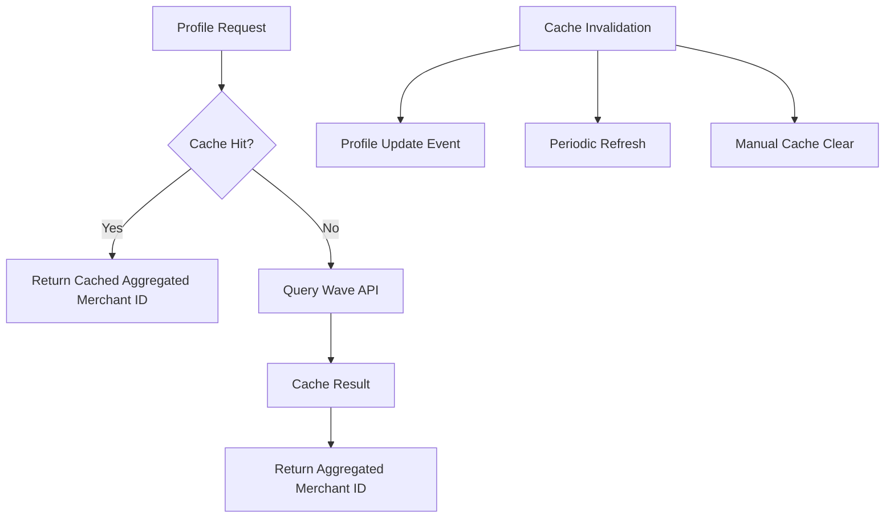
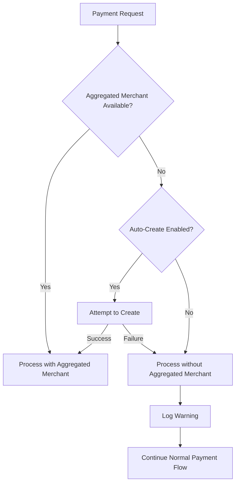
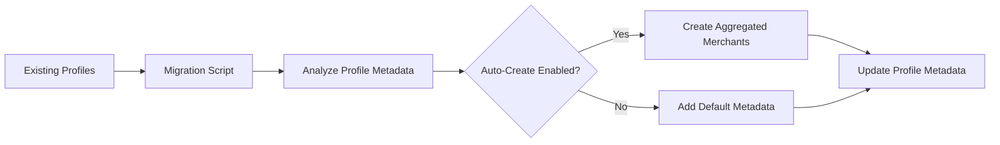
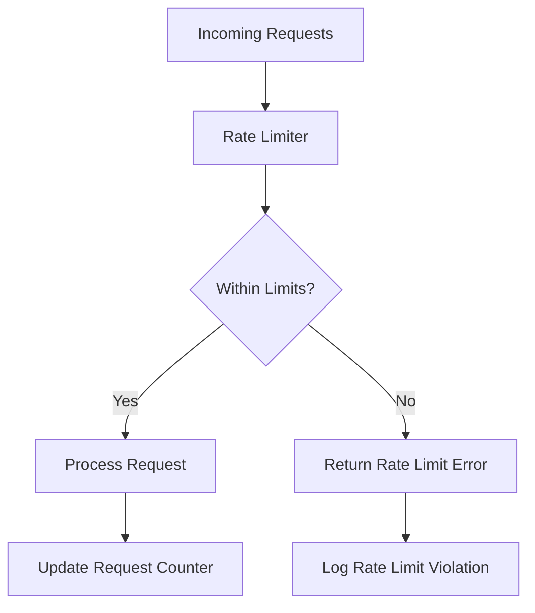

# Wave Aggregated Merchants Integration Design

## Overview

This design document outlines the integration of Wave's Aggregated Merchants API with the existing Wave connector in Hyperswitch. The objective is to enable Hyperswitch merchants to utilize Wave's aggregated merchant identities for payment processing, allowing them to operate under different merchant names and fee structures while maintaining the existing connector functionality.

### Problem Statement

Currently, the Wave connector in Hyperswitch supports basic payment operations but lacks integration with Wave's Aggregated Merchants API. This limitation prevents merchants from:
- Operating under multiple business identities through a single Hyperswitch merchant account
- Utilizing different fee structures for different business contexts
- Leveraging Wave's aggregated merchant capabilities for enhanced payment processing flexibility

### Solution Overview

The integration will extend the existing Wave connector to support aggregated merchants by:
1. Adding aggregated merchant management capabilities to the connector
2. Mapping Hyperswitch business profiles to Wave aggregated merchants
3. Enhancing payment requests to include aggregated merchant context
4. Maintaining backward compatibility with existing Wave connector functionality

## Architecture

### Current Architecture



### Enhanced Architecture with Aggregated Merchants



### Component Interaction



## Data Models

### Enhanced Wave Authentication Type

```rust
#[derive(Debug, Clone)]
pub struct WaveAuthType {
    pub api_key: Secret<String>,
    pub aggregated_merchants_enabled: bool,
}
```

### Wave Aggregated Merchant Data Structures

```rust
#[derive(Debug, Serialize, Deserialize, Clone)]
pub struct WaveAggregatedMerchant {
    pub id: String,
    pub name: String,
    pub business_type: WaveBusinessType,
    pub business_registration_identifier: Option<String>,
    pub business_sector: Option<String>,
    pub website_url: Option<String>,
    pub business_description: String,
    pub manager_name: Option<String>,
    pub payout_fee_structure_name: String,
    pub checkout_fee_structure_name: String,
    pub is_locked: bool,
    pub when_created: String,
}

#[derive(Debug, Serialize, Deserialize, Clone)]
pub enum WaveBusinessType {
    #[serde(rename = "fintech")]
    Fintech,
    #[serde(rename = "other")]
    Other,
}

#[derive(Debug, Serialize)]
pub struct WaveAggregatedMerchantRequest {
    pub name: String,
    pub business_type: WaveBusinessType,
    pub business_registration_identifier: Option<String>,
    pub business_sector: Option<String>,
    pub website_url: Option<String>,
    pub business_description: String,
    pub manager_name: Option<String>,
}
```

### Enhanced Merchant Connector Account Additional Data

```rust
#[derive(Debug, Clone, Serialize, Deserialize)]
pub struct WaveConnectorMetadata {
    pub aggregated_merchant_id: Option<String>,
    pub aggregated_merchant_name: Option<String>,
    pub auto_create_aggregated_merchant: Option<bool>,
    pub business_type: Option<WaveBusinessType>,
}
```

### Enhanced Wave Checkout Session Request

```rust
#[derive(Debug, Serialize)]
pub struct WaveCheckoutSessionRequest {
    pub amount: String,
    pub currency: String,
    pub error_url: Option<String>,
    pub success_url: Option<String>,
    pub reference: Option<String>,
    pub aggregated_merchant_id: Option<String>, // New field
    #[serde(skip_serializing_if = "Option::is_none")]
    pub customer: Option<WaveCustomer>,
}
```

## Business Logic Layer

### Aggregated Merchant Manager



### Core Business Logic

#### 1. Profile-to-Aggregated-Merchant Resolution

| Input | Process | Output |
|-------|---------|--------|
| Business Profile ID | Check connector metadata for aggregated_merchant_id | Aggregated Merchant ID |
| Business Profile metadata | Auto-create aggregated merchant if enabled | New Aggregated Merchant |
| Cached mapping | Return existing aggregated merchant | Cached Aggregated Merchant ID |

#### 2. Aggregated Merchant Lifecycle Management

| Operation | Trigger | Action |
|-----------|---------|--------|
| Create | Business Profile creation with auto_create enabled | Create Wave aggregated merchant |
| Update | Business Profile metadata update | Update Wave aggregated merchant details |
| Delete | Business Profile deletion | Optionally delete Wave aggregated merchant |
| Sync | Periodic sync job | Synchronize local cache with Wave API |

#### 3. Payment Processing Enhancement

| Step | Current Flow | Enhanced Flow |
|------|-------------|---------------|
| 1 | Create checkout session | Resolve aggregated merchant ID |
| 2 | Build Wave request | Include aggregated_merchant_id in request |
| 3 | Process payment | Payment processed under aggregated merchant context |
| 4 | Handle response | Enhanced response with aggregated merchant details |

## API Integration Layer

### New Wave API Endpoints

#### 1. Aggregated Merchants Management

```rust
const WAVE_AGGREGATED_MERCHANTS: &str = "v1/aggregated_merchants";
const WAVE_AGGREGATED_MERCHANT_BY_ID: &str = "v1/aggregated_merchants/{id}";
```

#### 2. Enhanced Connector Implementation

```rust
impl ConnectorIntegration<AggregatedMerchantCreate, WaveAggregatedMerchantRequest, WaveAggregatedMerchant> for Wave {
    fn get_url(&self, _req: &WaveAggregatedMerchantRouterData, connectors: &Connectors) -> CustomResult<String, errors::ConnectorError> {
        Ok(format!("{}{}", self.base_url(connectors), WAVE_AGGREGATED_MERCHANTS))
    }
    
    fn get_request_body(&self, req: &WaveAggregatedMerchantRouterData, _connectors: &Connectors) -> CustomResult<RequestContent, errors::ConnectorError> {
        let connector_req = WaveAggregatedMerchantRequest::try_from(req)?;
        Ok(RequestContent::Json(Box::new(connector_req)))
    }
}
```

### Enhanced Payment Request Flow

```rust
impl TryFrom<&WaveRouterData<&PaymentsAuthorizeRouterData>> for WaveCheckoutSessionRequest {
    type Error = error_stack::Report<ConnectorError>;
    
    fn try_from(item: &WaveRouterData<&PaymentsAuthorizeRouterData>) -> Result<Self, Self::Error> {
        let router_data = item.router_data;
        
        // Extract aggregated merchant ID from connector metadata
        let aggregated_merchant_id = extract_aggregated_merchant_id(router_data)?;
        
        Ok(Self {
            amount: item.amount.to_string(),
            currency: router_data.request.currency.to_string(),
            aggregated_merchant_id, // Include in request
            // ... other fields
        })
    }
}
```

## Middleware & Integration Points

### 1. Connector Authentication Enhancement



### 2. Profile Metadata Integration

| Metadata Field | Purpose | Example Value |
|----------------|---------|---------------|
| `aggregated_merchant_id` | Direct mapping to Wave aggregated merchant | `"am-7lks22ap113t4"` |
| `auto_create_aggregated_merchant` | Enable automatic creation | `true` |
| `business_type` | Wave business type classification | `"fintech"` |
| `business_description` | Description for aggregated merchant | `"Online payment processing"` |

### 3. Caching Strategy



## Configuration Management

### 1. Connector Configuration Schema

```json
{
  "connector_account_details": {
    "auth_type": "HeaderKey",
    "api_key": "wave_sn_prod_...",
    "aggregated_merchants_config": {
      "enabled": true,
      "auto_create_on_profile_creation": true,
      "default_business_type": "other",
      "cache_ttl_seconds": 3600
    }
  }
}
```

### 2. Business Profile Metadata Schema

```json
{
  "wave_aggregated_merchant": {
    "aggregated_merchant_id": "am-7lks22ap113t4",
    "auto_create": true,
    "business_type": "fintech",
    "business_description": "Payment processing for e-commerce",
    "manager_name": "John Doe"
  }
}
```

### 3. Environment Configuration

| Configuration Key | Description | Default Value |
|-------------------|-------------|---------------|
| `WAVE_AGGREGATED_MERCHANTS_CACHE_TTL` | Cache TTL in seconds | `3600` |
| `WAVE_AGGREGATED_MERCHANTS_ENABLED` | Global feature flag | `false` |
| `WAVE_AGGREGATED_MERCHANTS_AUTO_CREATE` | Auto-create default | `false` |

## Error Handling & Validation

### 1. Error Scenarios

| Error Type | Scenario | Handling Strategy |
|------------|----------|-------------------|
| `AggregatedMerchantNotFound` | Referenced aggregated merchant doesn't exist | Fallback to default merchant or create new |
| `AggregatedMerchantCreationFailed` | Failed to create aggregated merchant | Log error, proceed without aggregated merchant |
| `InvalidBusinessType` | Invalid business type in configuration | Default to "other" business type |
| `RateLimitExceeded` | Wave API rate limiting | Implement exponential backoff |

### 2. Validation Rules

```rust
impl Validator for WaveAggregatedMerchantRequest {
    fn validate(&self) -> Result<(), ValidationError> {
        // Name validation (required, max 255 characters, unique)
        if self.name.is_empty() || self.name.len() > 255 {
            return Err(ValidationError::InvalidName);
        }
        
        // Business description validation (required)
        if self.business_description.is_empty() {
            return Err(ValidationError::MissingBusinessDescription);
        }
        
        // Website URL validation (optional, max 2083 characters)
        if let Some(ref url) = self.website_url {
            if url.len() > 2083 {
                return Err(ValidationError::InvalidWebsiteUrl);
            }
        }
        
        Ok(())
    }
}
```

### 3. Graceful Degradation



## Testing Strategy

### 1. Unit Tests

| Test Category | Test Cases |
|---------------|------------|
| **Aggregated Merchant Resolution** | - Valid profile ID mapping<br>- Missing aggregated merchant handling<br>- Cache hit/miss scenarios |
| **Request Transformation** | - Checkout request with aggregated merchant ID<br>- Backward compatibility without aggregated merchant<br>- Invalid aggregated merchant ID handling |
| **API Integration** | - Successful aggregated merchant creation<br>- Failed creation handling<br>- Rate limiting scenarios |

### 2. Integration Tests

| Test Scenario | Expected Outcome |
|---------------|------------------|
| **End-to-End Payment with Aggregated Merchant** | Payment processed successfully under aggregated merchant identity |
| **Profile Creation with Auto-Create** | Aggregated merchant automatically created and linked |
| **Fallback to Default Merchant** | Payment continues without aggregated merchant when unavailable |
| **Cache Invalidation** | Cache properly updated on profile metadata changes |

### 3. Load Testing

| Metric | Target | Measurement |
|--------|--------|-------------|
| **Aggregated Merchant Resolution Time** | < 50ms | Average response time for cached lookups |
| **API Call Success Rate** | > 99.5% | Success rate for Wave API calls |
| **Cache Hit Rate** | > 95% | Percentage of requests served from cache |

## Migration Strategy

### 1. Phased Rollout

| Phase | Description | Duration | Success Criteria |
|-------|-------------|----------|------------------|
| **Phase 1** | Deploy with feature flag disabled | 1 week | No regression in existing functionality |
| **Phase 2** | Enable for test merchants | 2 weeks | Successful aggregated merchant operations |
| **Phase 3** | Gradual rollout to production | 4 weeks | Stable performance metrics |
| **Phase 4** | Full production deployment | Ongoing | Complete feature adoption |

### 2. Backward Compatibility

- Existing Wave connector configurations continue to work without modification
- Payments without aggregated merchant configuration process normally
- No breaking changes to existing API contracts
- Graceful handling of missing aggregated merchant metadata

### 3. Data Migration



## Monitoring & Observability

### 1. Metrics

| Metric | Purpose | Alert Threshold |
|--------|---------|-----------------|
| `wave_aggregated_merchant_cache_hit_rate` | Monitor cache efficiency | < 90% |
| `wave_aggregated_merchant_api_errors` | Track API failures | > 5% error rate |
| `wave_aggregated_merchant_creation_time` | Monitor creation performance | > 2 seconds |
| `wave_payments_with_aggregated_merchant` | Track feature adoption | N/A |

### 2. Logging Strategy

```rust
// Structured logging for aggregated merchant operations
log::info!(
    "Aggregated merchant resolved for profile",
    profile_id = %profile_id,
    aggregated_merchant_id = %aggregated_merchant_id,
    cache_hit = cache_hit,
    duration_ms = duration.as_millis()
);

log::warn!(
    "Aggregated merchant creation failed, continuing without",
    profile_id = %profile_id,
    error = %error,
    fallback_used = true
);
```

### 3. Health Checks

| Check | Frequency | Action on Failure |
|-------|-----------|-------------------|
| **Wave API Connectivity** | Every 5 minutes | Alert ops team |
| **Cache Service Health** | Every 1 minute | Fallback to direct API calls |
| **Aggregated Merchant Sync** | Every hour | Log discrepancies |

## Security Considerations

### 1. API Key Management

- Segregate aggregated merchant API permissions from payment API permissions
- Implement key rotation without service interruption
- Monitor API key usage patterns for anomalies

### 2. Data Protection

| Data Type | Protection Method | Access Control |
|-----------|------------------|----------------|
| **Aggregated Merchant IDs** | Encrypted in connector metadata | Profile-level access |
| **Business Information** | PII masking in logs | Admin-only access |
| **API Keys** | Encrypted storage with rotation | Service account access |

### 3. Rate Limiting




