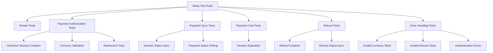
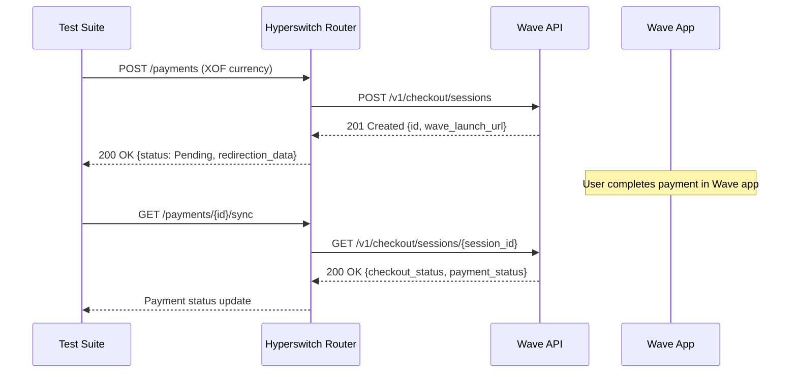
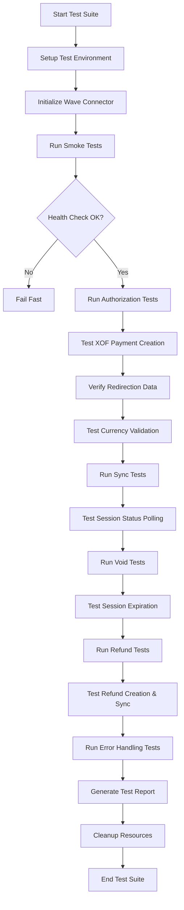

# Wave API Test Redesign with XOF Currency Support

## Overview

This design document outlines the comprehensive redesign of Wave connector tests to properly support XOF (West African Franc) currency and align with Wave's checkout API documentation. The current tests are failing due to incorrect API endpoints, improper currency handling, and misaligned test expectations.

## Technology Stack & Dependencies

- **Language**: Rust (edition 2021)
- **Test Framework**: Actix-web test framework with serial_test
- **Wave API Version**: v1 (Checkout API)
- **Supported Currency**: XOF only (no decimal places)
- **Payment Method**: Mobile wallet redirect (Wave app)

## Component Architecture

### Test Structure Hierarchy



### Wave API Integration Architecture



## API Endpoints Reference

### Wave Checkout API v1

| Operation | Endpoint | Method | Purpose |
|-----------|----------|---------|---------|
| Create Session | `/v1/checkout/sessions` | POST | Create checkout session |
| Get Session | `/v1/checkout/sessions/{id}` | GET | Get session status |
| Expire Session | `/v1/checkout/sessions/{id}/expire` | POST | Cancel/void session |
| Create Refund | `/v1/checkout/sessions/{id}/refund` | POST | Refund payment |

### Request/Response Schema

#### Checkout Session Creation Request
```rust
#[derive(Serialize)]
struct WaveCheckoutSessionRequest {
    amount: String,           // "1000" (XOF, no decimals)
    currency: String,         // "XOF"
    success_url: String,      // Return URL after success
    error_url: String,        // Return URL after error
    client_reference: Option<String>, // Optional correlation ID
}
```

#### Checkout Session Response
```rust
#[derive(Deserialize)]
struct WaveCheckoutSessionResponse {
    id: String,                    // "cos-18qq25rgr100a"
    amount: String,                // "1000"
    currency: String,              // "XOF"
    checkout_status: WaveCheckoutStatus, // open, complete, expired
    payment_status: WavePaymentStatus,   // processing, cancelled, succeeded
    wave_launch_url: String,       // Redirect URL for Wave app
    when_created: String,          // ISO 8601 timestamp
    when_expires: String,          // ISO 8601 timestamp
}
```

## Data Models & ORM Mapping

### Currency Support
- **XOF Only**: Wave exclusively supports West African Franc (XOF)
- **No Decimal Places**: XOF amounts must be whole numbers (e.g., "1000" not "10.00")
- **Amount Format**: String representation required by Wave API

### Payment Method Mapping
```rust
// Wave uses mobile wallet redirect payment method
PaymentMethodData::Wallet(
    WalletData::MobilePayRedirect(
        Box::new(MobilePayRedirection {})
    )
)
```

### Status Mapping
```rust
// Wave checkout statuses to Hyperswitch attempt statuses
match wave_checkout_status {
    WaveCheckoutStatus::Open => AttemptStatus::Pending,
    WaveCheckoutStatus::Complete => match payment_status {
        WavePaymentStatus::Succeeded => AttemptStatus::Charged,
        WavePaymentStatus::Cancelled => AttemptStatus::Failure,
        WavePaymentStatus::Processing => AttemptStatus::Pending,
    },
    WaveCheckoutStatus::Expired => AttemptStatus::Voided,
}
```

## Business Logic Layer Architecture

### Test Case Categories

#### 1. Authentication & Connectivity Tests
```rust
#[actix_web::test]
async fn wave_smoke_health_check() {
    // Verify basic connectivity and health endpoint
}

#[actix_web::test] 
async fn wave_connector_attachment_test() {
    // Verify Wave connector can be attached with valid API key
}
```

#### 2. Payment Authorization Tests
```rust
#[actix_web::test]
async fn should_create_checkout_session_with_xof() {
    // Create checkout session with XOF currency
    // Verify session ID and wave_launch_url returned
    // Assert status is Pending
}

#[actix_web::test]
async fn should_provide_redirection_data() {
    // Verify Wave returns proper redirection data
    // Check wave_launch_url format and accessibility
}
```

#### 3. Currency Validation Tests
```rust
#[actix_web::test]
async fn should_reject_non_xof_currencies() {
    // Test USD, EUR, NGN rejection
    // Verify proper error handling
}

#[actix_web::test]
async fn should_reject_decimal_amounts_for_xof() {
    // XOF doesn't support decimal places
    // Test amounts like 10.50 XOF should fail
}
```

#### 4. Payment Synchronization Tests
```rust
#[actix_web::test]
async fn should_sync_checkout_session_status() {
    // Poll checkout session status
    // Verify status transitions
}

#[actix_web::test]
async fn should_handle_expired_sessions() {
    // Test session expiration scenarios
}
```

#### 5. Payment Void/Cancellation Tests
```rust
#[actix_web::test]
async fn should_expire_checkout_session() {
    // Use expire endpoint to cancel session
    // Verify session moves to expired status
}
```

#### 6. Refund Tests
```rust
#[actix_web::test]
async fn should_create_refund_for_succeeded_payment() {
    // Create refund using checkout session refund endpoint
    // Verify refund creation and status
}

#[actix_web::test]
async fn should_sync_refund_status() {
    // Poll refund status until completion
}
```

## Middleware & Interceptors

### Authentication Handler
```rust
fn get_auth_header(&self) -> Vec<(String, Maskable<String>)> {
    vec![(
        "Authorization".to_string(),
        format!("Bearer {}", self.api_key.peek()).into_masked(),
    )]
}
```

### Request/Response Transformation
```rust
// Amount conversion for XOF (no decimals)
fn convert_amount_for_xof(minor_amount: MinorUnit) -> String {
    minor_amount.to_string() // XOF uses 1:1 minor to major unit ratio
}

// URL construction with proper base URL
const WAVE_BASE_URL: &str = "https://api.wave.com/";
```

## Testing Strategy

### Test Data Factory
```rust
fn get_xof_payment_data() -> PaymentsAuthorizeData {
    PaymentsAuthorizeData {
        payment_method_data: PaymentMethodData::Wallet(
            WalletData::MobilePayRedirect(Box::new(MobilePayRedirection {}))
        ),
        currency: Currency::XOF,
        amount: 1000,
        minor_amount: MinorUnit::new(1000),
        email: Some(Email::from_str("test@wave.com").unwrap()),
        customer_name: Some(Secret::new("John Doe".to_string())),
        router_return_url: Some("https://example.com/return".to_string()),
        ..PaymentAuthorizeType::default().0
    }
}

fn get_invalid_currency_data(currency: Currency) -> PaymentsAuthorizeData {
    PaymentsAuthorizeData {
        currency,
        ..get_xof_payment_data()
    }
}
```

### Error Scenarios Testing
```rust
// Test Matrix for Error Handling
const ERROR_TEST_CASES: &[(&str, Currency, i64, &str)] = &[
    ("Invalid Currency USD", Currency::USD, 1000, "Currency not supported"),
    ("Invalid Currency EUR", Currency::EUR, 1000, "Currency not supported"), 
    ("Invalid Currency NGN", Currency::NGN, 1000, "Currency not supported"),
    ("Zero Amount XOF", Currency::XOF, 0, "Invalid amount"),
    ("Negative Amount XOF", Currency::XOF, -100, "Invalid amount"),
];
```

### Retry and Timeout Strategy
```rust
// Payment sync with configurable retry
async fn sync_with_retry(
    &self,
    expected_status: AttemptStatus,
    max_retries: u32,
    interval_seconds: u64,
) -> Result<PaymentsSyncRouterData, ConnectorError> {
    for attempt in 0..max_retries {
        let result = self.sync_payment(None, None).await?;
        
        if result.status == expected_status || attempt == max_retries - 1 {
            return Ok(result);
        }
        
        tokio::time::sleep(Duration::from_secs(interval_seconds)).await;
    }
    
    Err(ConnectorError::ProcessingStepFailed(None))
}
```

### Test Configuration
```rust
// Wave-specific test configuration
#[derive(Debug)]
struct WaveTestConfig {
    api_key: String,
    base_url: String,
    timeout_seconds: u64,
    max_retries: u32,
    supported_currencies: Vec<Currency>,
}

impl Default for WaveTestConfig {
    fn default() -> Self {
        Self {
            api_key: std::env::var("WAVE_API_KEY")
                .unwrap_or_else(|_| "test_api_key".to_string()),
            base_url: "https://api.wave.com/".to_string(),
            timeout_seconds: 30,
            max_retries: 3,
            supported_currencies: vec![Currency::XOF],
        }
    }
}
```

### Integration Test Flow


## Key Improvements from Previous Implementation

1. **Correct API Endpoints**: Updated to use Wave's v1 checkout API instead of incorrect URLs
2. **XOF Currency Focus**: All tests specifically designed for XOF currency requirements
3. **Proper Status Mapping**: Aligned Wave checkout/payment statuses with Hyperswitch attempt statuses
4. **Redirection Flow Testing**: Validates wave_launch_url and redirection data handling
5. **Comprehensive Error Testing**: Tests all unsupported currencies and edge cases
6. **Retry Logic**: Implements proper retry mechanisms for async operations
7. **Session Lifecycle**: Tests complete checkout session lifecycle from creation to completion/expiration
8. **Refund Integration**: Uses Wave's checkout session refund endpoint instead of separate transaction API