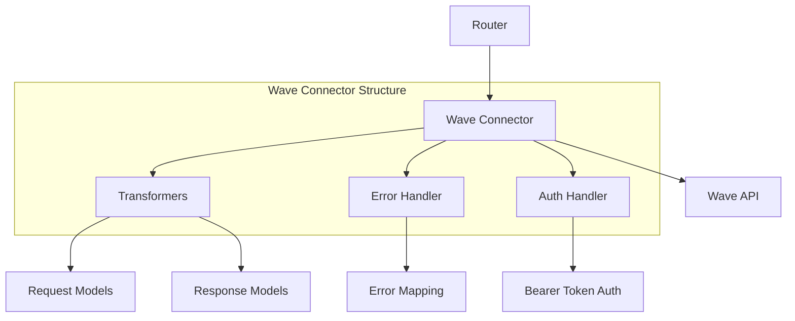
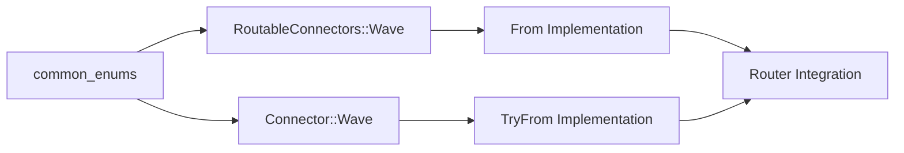

# Wave Connector Integration Design Document

## Overview

This document outlines the design for implementing the Wave payment connector integration in the Hyperswitch payment processing platform. The Wave connector has been partially added to the system but requires proper implementation to resolve compilation errors and provide complete payment processing capabilities.

**Current Issue**: The Wave connector enum has been added to `RoutableConnectors` and `Connector` enums in `common_enums`, but the match statements haven't been updated to handle the new variant, causing non-exhaustive pattern compilation errors.

**Objective**: Complete the Wave connector integration by implementing proper enum mappings, error handling, and payment processing logic following Hyperswitch's connector architecture patterns.

## Architecture

### Component Overview

The Wave connector implementation follows Hyperswitch's modular connector architecture:



### Connector Registration Architecture



## Data Models & Error Handling

### Error Response Schema

Wave connector uses standardized error response format:

| Field | Type | Description |
|-------|------|-------------|
| status_code | u16 | HTTP status code |
| code | String | Wave-specific error code |
| message | String | Human-readable error message |
| reason | Option\<String\> | Additional error details |
| connector_transaction_id | Option\<String\> | Wave transaction reference |

### Error Mapping Pattern

Wave connector implements comprehensive error mapping between Wave API responses and Hyperswitch error types:

- **UserError**: Invalid payment data, expired cards, insufficient funds
- **BusinessError**: Account issues, currency mismatches, blocked transactions  
- **TechnicalError**: Network timeouts, API unavailable, processing failures
- **UnknownError**: Unclassified or unexpected errors

### Authentication Schema

Wave uses Bearer token authentication:

```rust
ConnectorAuthType::HeaderKey {
    api_key: "Authorization".to_string(),
}
```

## Business Logic Layer

### Payment Flow Architecture

#### Authorization Flow
1. **Request Transformation**: Convert Hyperswitch payment data to Wave API format
2. **Authentication**: Add Bearer token to request headers
3. **API Call**: Execute payment authorization with Wave
4. **Response Processing**: Transform Wave response to Hyperswitch format
5. **Error Handling**: Map Wave errors to appropriate Hyperswitch error types

#### Capture Flow
1. **Capture Request**: Use authorized payment reference
2. **Amount Validation**: Ensure capture amount ≤ authorized amount  
3. **API Execution**: Execute capture via Wave API
4. **Status Update**: Update payment status in Hyperswitch

#### Refund Flow
1. **Refund Validation**: Verify refund eligibility and amount
2. **Reference Lookup**: Use original transaction ID
3. **Refund Execution**: Process refund through Wave API
4. **Reconciliation**: Update payment records

### Payment Method Support

Wave connector supports:
- **Credit/Debit Cards**: Visa, Mastercard, American Express
- **Digital Wallets**: Apple Pay, Google Pay
- **Bank Transfers**: ACH, Wire transfers
- **Alternative Payments**: Regional payment methods

## API Endpoints Reference

### Core Integration Points

| Operation | Wave Endpoint | HTTP Method | Authentication |
|-----------|---------------|-------------|----------------|
| Authorize | `/payments` | POST | Bearer Token |
| Capture | `/payments/{id}/capture` | POST | Bearer Token |
| Void | `/payments/{id}/void` | POST | Bearer Token |
| Refund | `/refunds` | POST | Bearer Token |
| Status | `/payments/{id}` | GET | Bearer Token |

### Request/Response Schema

#### Authorization Request
```json
{
  "amount": 1000,
  "currency": "USD", 
  "payment_method": {
    "type": "card",
    "card": {
      "number": "[MASKED]",
      "exp_month": 12,
      "exp_year": 2025,
      "cvc": "[MASKED]"
    }
  },
  "return_url": "https://merchant.com/return"
}
```

#### Authorization Response  
```json
{
  "id": "wave_txn_123",
  "status": "authorized",
  "amount": 1000,
  "currency": "USD",
  "created": "2024-01-15T10:30:00Z"
}
```

## Middleware & Interceptors

### Request Middleware
- **Authentication Injection**: Automatically adds Bearer token to requests
- **Request Logging**: Logs outgoing requests for debugging
- **Rate Limiting**: Implements exponential backoff for API limits
- **Request Transformation**: Converts Hyperswitch format to Wave format

### Response Middleware  
- **Response Logging**: Logs incoming responses for debugging
- **Error Classification**: Categorizes errors by type and severity
- **Response Transformation**: Converts Wave format to Hyperswitch format
- **Webhook Validation**: Validates incoming webhook signatures

## Testing Strategy

### Unit Testing

#### Connector Logic Tests
```rust
#[cfg(test)]
mod tests {
    use crate::connector::wave::Wave;
    
    #[test]
    fn test_payment_authorization() {
        // Test successful payment authorization
    }
    
    #[test]
    fn test_error_handling() {
        // Test various error scenarios
    }
    
    #[test] 
    fn test_amount_conversion() {
        // Test currency amount handling
    }
}
```

#### Error Mapping Tests
- Verify all Wave error codes map to appropriate Hyperswitch error types
- Test edge cases and unknown error handling
- Validate error message formatting and logging

#### Authentication Tests
- Test Bearer token injection
- Verify authentication failure handling
- Test token refresh scenarios

### Integration Testing

#### API Integration Tests
```rust
#[tokio::test]
async fn test_wave_payment_flow() {
    // End-to-end payment processing test
}

#[tokio::test]
async fn test_wave_refund_flow() {
    // End-to-end refund processing test
}
```

#### Configuration Tests
- Test connector configuration loading
- Verify environment-specific settings
- Test feature flag handling

### Test Data Management
- Use test API keys for sandbox environment
- Implement test card numbers for various scenarios
- Mock external dependencies for unit tests

## Implementation Requirements

### Enum Registration Fix

#### 1. Update RoutableConnectors Conversion
In `crates/common_enums/src/connector_enums.rs`, add Wave mapping:

```rust
// Line ~713 - Add to From<RoutableConnectors> for Connector
RoutableConnectors::Wave => Self::Wave,
```

#### 2. Update Connector Conversion  
```rust
// Line ~854 - Add to TryFrom<Connector> for RoutableConnectors  
Connector::Wave => Ok(Self::Wave),
```

### Connector Implementation Structure

#### Main Connector Module
```
crates/hyperswitch_connectors/src/connectors/wave.rs
├── Wave struct implementation
├── ConnectorIntegration trait implementations
├── Error handling logic
└── Authentication logic
```

#### Transformers Module
```
crates/hyperswitch_connectors/src/connectors/wave/
├── transformers.rs (request/response models)
├── types.rs (Wave-specific types)
└── utils.rs (helper functions)
```

### Router Integration

#### Connector Registration
Add Wave to router's connector registry in:
```
crates/router/src/types.rs
```

Update connector_transformers mapping to include Wave connector.

#### Test Integration
Create test file:
```
crates/router/tests/connectors/wave.rs
```

### Configuration Requirements

#### Environment Variables
- `WAVE_API_KEY`: Production API key
- `WAVE_SANDBOX_API_KEY`: Sandbox API key  
- `WAVE_BASE_URL`: API base URL
- `WAVE_WEBHOOK_SECRET`: Webhook validation secret

#### Feature Flags
- Enable Wave connector in deployment configurations
- Support environment-specific feature toggles
- Implement gradual rollout capabilities