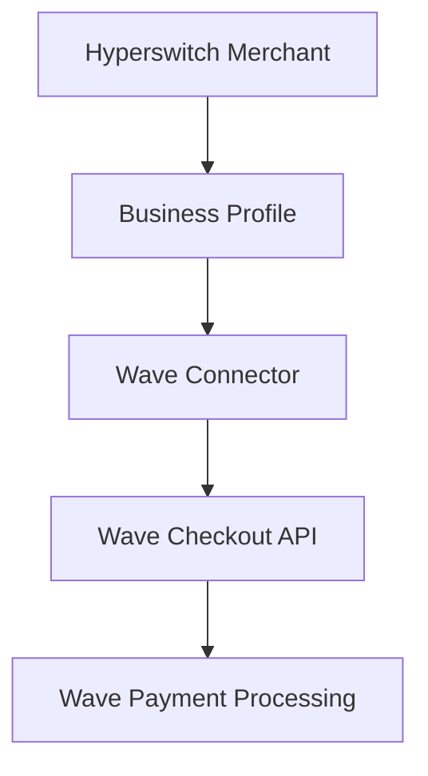
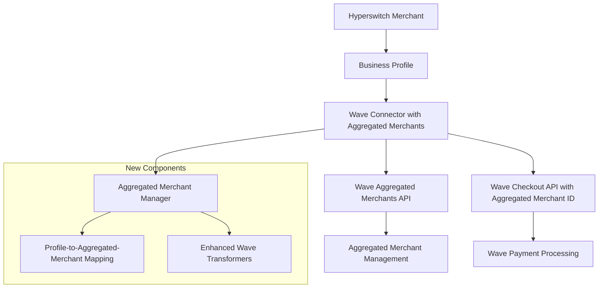
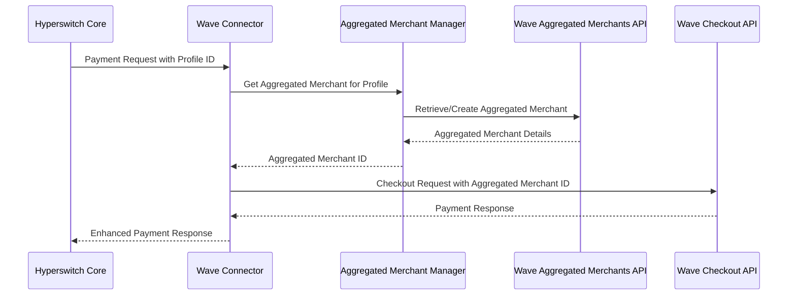
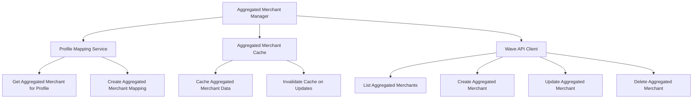
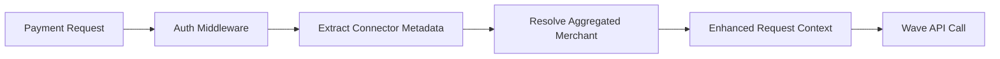
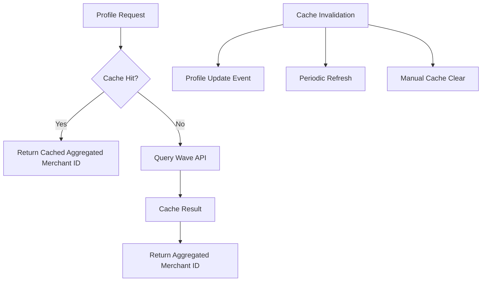
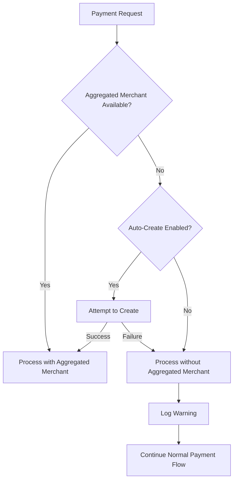
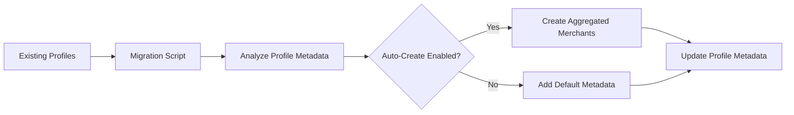
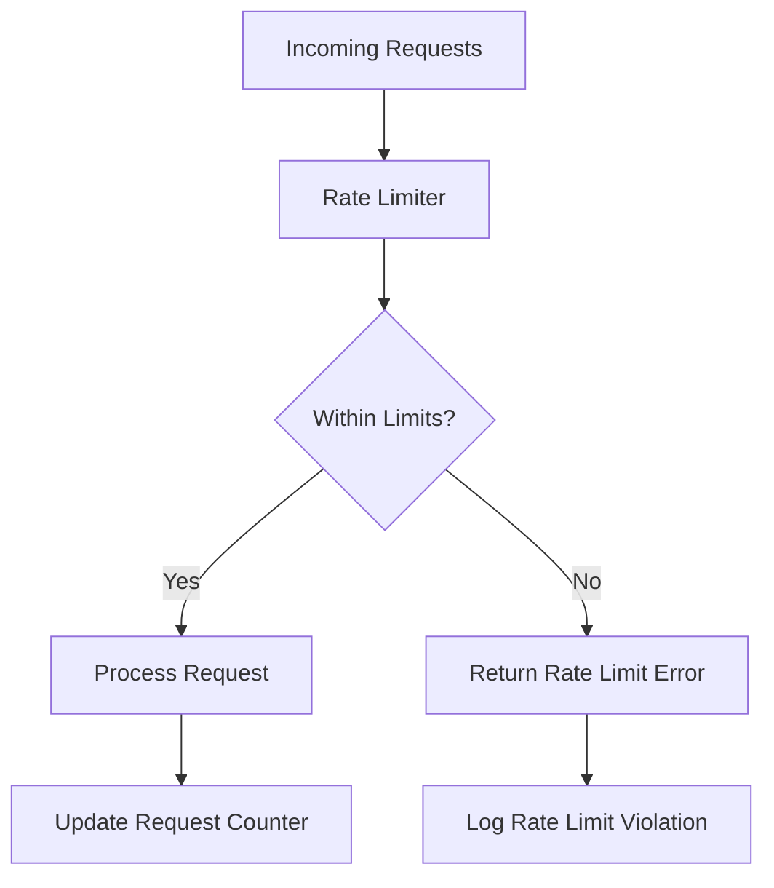

# Wave Aggregated Merchants Integration Design

## Overview

This design document outlines the integration of Wave's Aggregated Merchants API with the existing Wave connector in Hyperswitch. The objective is to enable Hyperswitch merchants to utilize Wave's aggregated merchant identities for payment processing, allowing them to operate under different merchant names and fee structures while maintaining the existing connector functionality.

### Problem Statement

Currently, the Wave connector in Hyperswitch supports basic payment operations but lacks integration with Wave's Aggregated Merchants API. This limitation prevents merchants from:
- Operating under multiple business identities through a single Hyperswitch merchant account
- Utilizing different fee structures for different business contexts
- Leveraging Wave's aggregated merchant capabilities for enhanced payment processing flexibility

### Solution Overview

The integration will extend the existing Wave connector to support aggregated merchants by:
1. Adding aggregated merchant management capabilities to the connector
2. Mapping Hyperswitch business profiles to Wave aggregated merchants
3. Enhancing payment requests to include aggregated merchant context
4. Maintaining backward compatibility with existing Wave connector functionality

## Architecture

### Current Architecture



### Enhanced Architecture with Aggregated Merchants



### Component Interaction



## Data Models & ORM Mapping

### Enhanced Wave Authentication Type

| Field | Type | Description |
|-------|------|-------------|
| `api_key` | `Secret<String>` | Wave API authentication key |
| `aggregated_merchants_enabled` | `bool` | Feature flag for aggregated merchants |

### Wave Aggregated Merchant Data Structures

| Field | Type | Description |
|-------|------|-------------|
| `id` | `String` | Unique aggregated merchant identifier |
| `name` | `String` | Business name for the aggregated merchant |
| `business_type` | `WaveBusinessType` | Business classification (fintech/other) |
| `business_registration_identifier` | `Option<String>` | Business registration number |
| `business_sector` | `Option<String>` | Industry sector |
| `website_url` | `Option<String>` | Business website URL |
| `business_description` | `String` | Business description |
| `manager_name` | `Option<String>` | Manager contact name |
| `payout_fee_structure_name` | `String` | Fee structure for payouts |
| `checkout_fee_structure_name` | `String` | Fee structure for checkouts |
| `is_locked` | `bool` | Whether merchant is locked |
| `when_created` | `String` | Creation timestamp |

### Enhanced Merchant Connector Account Additional Data

| Field | Type | Description |
|-------|------|-------------|
| `aggregated_merchant_id` | `Option<String>` | Linked Wave aggregated merchant ID |
| `aggregated_merchant_name` | `Option<String>` | Display name for the aggregated merchant |
| `auto_create_aggregated_merchant` | `Option<bool>` | Auto-create flag |
| `business_type` | `Option<WaveBusinessType>` | Business type classification |

### Enhanced Wave Checkout Session Request

| Field | Type | Description |
|-------|------|-------------|
| `amount` | `String` | Payment amount |
| `currency` | `String` | Payment currency |
| `error_url` | `Option<String>` | Error redirect URL |
| `success_url` | `Option<String>` | Success redirect URL |
| `reference` | `Option<String>` | Payment reference |
| `aggregated_merchant_id` | `Option<String>` | **New field** for aggregated merchant |
| `customer` | `Option<WaveCustomer>` | Customer information |

## Business Logic Layer

### Aggregated Merchant Manager



### Core Business Logic

#### Profile-to-Aggregated-Merchant Resolution

| Input | Process | Output |
|-------|---------|--------|
| Business Profile ID | Check connector metadata for aggregated_merchant_id | Aggregated Merchant ID |
| Business Profile metadata | Auto-create aggregated merchant if enabled | New Aggregated Merchant |
| Cached mapping | Return existing aggregated merchant | Cached Aggregated Merchant ID |

#### Aggregated Merchant Lifecycle Management

| Operation | Trigger | Action |
|-----------|---------|--------|
| Create | Business Profile creation with auto_create enabled | Create Wave aggregated merchant |
| Update | Business Profile metadata update | Update Wave aggregated merchant details |
| Delete | Business Profile deletion | Optionally delete Wave aggregated merchant |
| Sync | Periodic sync job | Synchronize local cache with Wave API |

#### Payment Processing Enhancement

| Step | Current Flow | Enhanced Flow |
|------|-------------|---------------|
| 1 | Create checkout session | Resolve aggregated merchant ID |
| 2 | Build Wave request | Include aggregated_merchant_id in request |
| 3 | Process payment | Payment processed under aggregated merchant context |
| 4 | Handle response | Enhanced response with aggregated merchant details |

## API Endpoints Reference

### New Wave API Endpoints

#### Aggregated Merchants Management

| Endpoint | Method | Description |
|----------|--------|-------------|
| `/v1/aggregated_merchants` | GET | List aggregated merchants |
| `/v1/aggregated_merchants` | POST | Create new aggregated merchant |
| `/v1/aggregated_merchants/{id}` | GET | Get aggregated merchant details |
| `/v1/aggregated_merchants/{id}` | PUT | Update aggregated merchant |
| `/v1/aggregated_merchants/{id}` | DELETE | Delete aggregated merchant |

#### Request/Response Schema

**Create Aggregated Merchant Request:**
```json
{
  "name": "string",
  "business_type": "fintech|other",
  "business_registration_identifier": "string (optional)",
  "business_sector": "string (optional)",
  "website_url": "string (optional)",
  "business_description": "string",
  "manager_name": "string (optional)"
}
```

**Aggregated Merchant Response:**
```json
{
  "id": "am-7lks22ap113t4",
  "name": "Business Name",
  "business_type": "fintech",
  "business_description": "Payment processing business",
  "payout_fee_structure_name": "standard",
  "checkout_fee_structure_name": "standard",
  "is_locked": false,
  "when_created": "2024-01-01T00:00:00Z"
}
```

#### Authentication Requirements

All aggregated merchant API calls require:
- Wave API key in `Authorization` header
- `Content-Type: application/json` for POST/PUT requests

### Enhanced Payment Request Flow

The payment authorization flow is enhanced to include aggregated merchant resolution:

1. **Extract Profile Context**: Get business profile ID from payment request
2. **Resolve Aggregated Merchant**: Look up aggregated merchant ID from profile metadata
3. **Enhance Checkout Request**: Include `aggregated_merchant_id` in Wave checkout session request
4. **Process Payment**: Wave processes payment under aggregated merchant context
5. **Return Enhanced Response**: Include aggregated merchant details in response

## Middleware & Interceptors

### Connector Authentication Enhancement



### Profile Metadata Integration

| Metadata Field | Purpose | Example Value |
|----------------|---------|---------------|
| `aggregated_merchant_id` | Direct mapping to Wave aggregated merchant | `"am-7lks22ap113t4"` |
| `auto_create_aggregated_merchant` | Enable automatic creation | `true` |
| `business_type` | Wave business type classification | `"fintech"` |
| `business_description` | Description for aggregated merchant | `"Online payment processing"` |

### Caching Strategy



## Configuration Management

### Connector Configuration Schema

```json
{
  "connector_account_details": {
    "auth_type": "HeaderKey",
    "api_key": "wave_sn_prod_...",
    "aggregated_merchants_config": {
      "enabled": true,
      "auto_create_on_profile_creation": true,
      "default_business_type": "other",
      "cache_ttl_seconds": 3600
    }
  }
}
```

### Business Profile Metadata Schema

```json
{
  "wave_aggregated_merchant": {
    "aggregated_merchant_id": "am-7lks22ap113t4",
    "auto_create": true,
    "business_type": "fintech",
    "business_description": "Payment processing for e-commerce",
    "manager_name": "John Doe"
  }
}
```

### Environment Configuration

| Configuration Key | Description | Default Value |
|-------------------|-------------|---------------|
| `WAVE_AGGREGATED_MERCHANTS_CACHE_TTL` | Cache TTL in seconds | `3600` |
| `WAVE_AGGREGATED_MERCHANTS_ENABLED` | Global feature flag | `false` |
| `WAVE_AGGREGATED_MERCHANTS_AUTO_CREATE` | Auto-create default | `false` |

## Error Handling & Validation

### Error Scenarios

| Error Type | Scenario | Handling Strategy |
|------------|----------|-------------------|
| `AggregatedMerchantNotFound` | Referenced aggregated merchant doesn't exist | Fallback to default merchant or create new |
| `AggregatedMerchantCreationFailed` | Failed to create aggregated merchant | Log error, proceed without aggregated merchant |
| `InvalidBusinessType` | Invalid business type in configuration | Default to "other" business type |
| `RateLimitExceeded` | Wave API rate limiting | Implement exponential backoff |

### Validation Rules

| Field | Validation Rules |
|-------|------------------|
| `name` | Required, max 255 characters, unique |
| `business_description` | Required, not empty |
| `website_url` | Optional, max 2083 characters, valid URL format |
| `business_type` | Must be "fintech" or "other" |

### Graceful Degradation



## Testing

### Unit Tests

| Test Category | Test Cases |
|---------------|------------|
| **Aggregated Merchant Resolution** | - Valid profile ID mapping<br>- Missing aggregated merchant handling<br>- Cache hit/miss scenarios |
| **Request Transformation** | - Checkout request with aggregated merchant ID<br>- Backward compatibility without aggregated merchant<br>- Invalid aggregated merchant ID handling |
| **API Integration** | - Successful aggregated merchant creation<br>- Failed creation handling<br>- Rate limiting scenarios |

### Integration Tests

| Test Scenario | Expected Outcome |
|---------------|------------------|
| **End-to-End Payment with Aggregated Merchant** | Payment processed successfully under aggregated merchant identity |
| **Profile Creation with Auto-Create** | Aggregated merchant automatically created and linked |
| **Fallback to Default Merchant** | Payment continues without aggregated merchant when unavailable |
| **Cache Invalidation** | Cache properly updated on profile metadata changes |

### Load Testing

| Metric | Target | Measurement |
|--------|--------|-------------|
| **Aggregated Merchant Resolution Time** | < 50ms | Average response time for cached lookups |
| **API Call Success Rate** | > 99.5% | Success rate for Wave API calls |
| **Cache Hit Rate** | > 95% | Percentage of requests served from cache |

## Migration & Backward Compatibility

### Phased Rollout

| Phase | Description | Duration | Success Criteria |
|-------|-------------|----------|------------------|
| **Phase 1** | Deploy with feature flag disabled | 1 week | No regression in existing functionality |
| **Phase 2** | Enable for test merchants | 2 weeks | Successful aggregated merchant operations |
| **Phase 3** | Gradual rollout to production | 4 weeks | Stable performance metrics |
| **Phase 4** | Full production enablement | Ongoing | Complete feature adoption |

### Backward Compatibility

- Existing Wave connector configurations continue to work without modification
- Payments without aggregated merchant configuration process normally
- No breaking changes to existing API contracts
- Graceful handling of missing aggregated merchant metadata

### Data Migration



## Monitoring & Security

### Monitoring Metrics

| Metric | Purpose | Alert Threshold |
|--------|---------|-----------------|
| `wave_aggregated_merchant_cache_hit_rate` | Monitor cache efficiency | < 90% |
| `wave_aggregated_merchant_api_errors` | Track API failures | > 5% error rate |
| `wave_aggregated_merchant_creation_time` | Monitor creation performance | > 2 seconds |
| `wave_payments_with_aggregated_merchant` | Track feature adoption | N/A |

### Security Considerations

#### API Key Management

- Segregate aggregated merchant API permissions from payment API permissions
- Implement key rotation without service interruption
- Monitor API key usage patterns for anomalies

#### Data Protection

| Data Type | Protection Method | Access Control |
|-----------|------------------|----------------|
| **Aggregated Merchant IDs** | Encrypted in connector metadata | Profile-level access |
| **Business Information** | PII masking in logs | Admin-only access |
| **API Keys** | Encrypted storage with rotation | Service account access |

#### Rate Limiting

