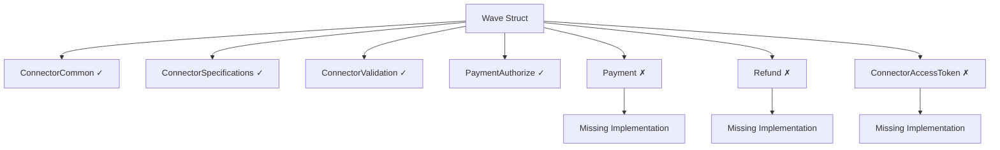
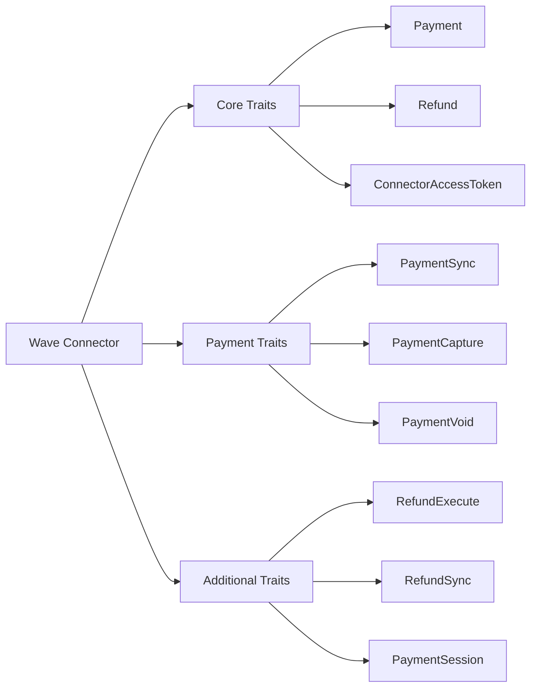
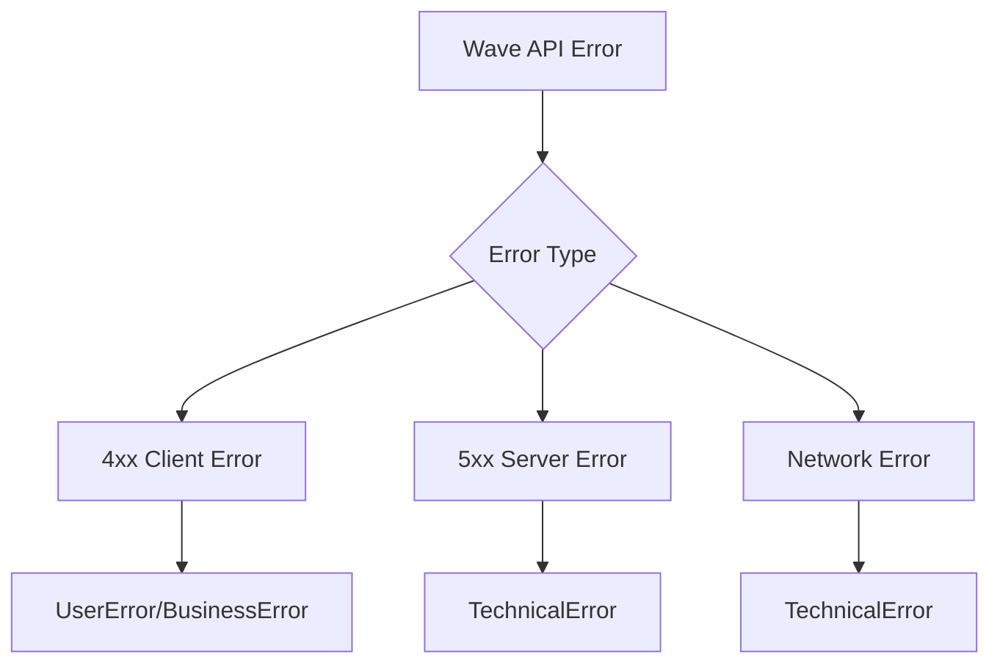

# Wave Connector Implementation Design Document

## Overview

This document outlines the design for completing the Wave payment connector integration in the Hyperswitch payment processing platform. The Wave connector has been partially implemented but is missing critical trait implementations that are causing compilation errors.

**Current Issue**: The Wave connector struct exists but lacks implementations for required traits (`Payment`, `Refund`, `ConnectorAccessToken`) that are needed to satisfy the `Connector` trait bounds.

**Objective**: Complete the Wave connector by implementing all required API traits and payment processing capabilities following Hyperswitch's connector architecture patterns.

## Architecture

### Current Wave Connector Structure



### Required Trait Implementation Architecture



## Data Models & Error Handling

### Wave API Response Types

| Response Type | Purpose | Status Mapping |
|---------------|---------|----------------|
| WaveCheckoutSessionResponse | Payment authorization | Pending → requires user action |
| WavePaymentsCancelResponse | Payment cancellation | Voided |
| WaveRefundResponse | Refund processing | Success/Pending/Failed |
| WaveErrorResponse | Error handling | Various error types |

### Error Classification Strategy



## Business Logic Layer

### Payment Flow Implementation

#### Authorization Flow
1. **Request Transformation**: Convert Hyperswitch data to Wave checkout session format
2. **API Communication**: Create checkout session via Wave API
3. **Response Processing**: Extract redirection URL for customer completion
4. **Status Management**: Set initial status as Pending

#### Synchronization Flow  
1. **Status Query**: Check payment status via Wave API
2. **Status Translation**: Map Wave status to Hyperswitch status
3. **Data Updates**: Update payment information based on current status

#### Refund Flow
1. **Refund Request**: Create refund via Wave API using original transaction ID
2. **Amount Validation**: Ensure refund amount is within limits
3. **Status Tracking**: Monitor refund processing status

### Authentication Strategy

Wave uses Bearer token authentication pattern:
- Header: `Authorization: Bearer {api_key}`
- Implemented via `ConnectorAuthType::HeaderKey`

## API Endpoints Reference

### Core Wave API Endpoints

| Operation | Endpoint | Method | Implementation Status |
|-----------|----------|--------|---------------------|
| Create Session | `/checkout/sessions` | POST | ✓ Implemented |
| Get Session | `/checkout/sessions/{id}` | GET | ⚠ Needed for sync |
| Cancel Payment | `/v1/transactions/{id}/cancel` | POST | ⚠ Needed for void |
| Create Refund | `/v1/transactions/{id}/refunds` | POST | ⚠ Needed for refunds |
| Get Refund | `/v1/refunds/{id}` | GET | ⚠ Needed for refund sync |

### Request/Response Schema

#### Checkout Session Request
```json
{
  "amount": "1000",
  "currency": "XOF",
  "payment_method_types": ["wave_money"],
  "success_url": "https://merchant.com/success",
  "cancel_url": "https://merchant.com/cancel",
  "metadata": {
    "order_id": "order_123"
  }
}
```

#### Checkout Session Response
```json
{
  "id": "cs_wave_123",
  "url": "https://checkout.wave.com/cs_wave_123",
  "status": "open",
  "amount": "1000",
  "currency": "XOF"
}
```

## Implementation Requirements

### Missing Trait Implementations

#### 1. Core Payment Traits
```rust
impl api::Payment for Wave {}
impl api::PaymentSession for Wave {}
impl api::PaymentSync for Wave {}
impl api::PaymentCapture for Wave {}
impl api::PaymentVoid for Wave {}
```

#### 2. Refund Traits
```rust
impl api::Refund for Wave {}
impl api::RefundExecute for Wave {}
impl api::RefundSync for Wave {}
```

#### 3. Authentication Traits
```rust
impl api::ConnectorAccessToken for Wave {}
impl api::MandateSetup for Wave {}
impl api::PaymentToken for Wave {}
```

### ConnectorIntegration Implementations

#### Payment Synchronization
```rust
impl ConnectorIntegration<PSync, PaymentsSyncData, PaymentsResponseData> for Wave {
    fn get_url(&self, req: &PaymentsSyncRouterData, connectors: &Connectors) -> CustomResult<String, errors::ConnectorError> {
        // Implementation needed
    }
    
    fn handle_response(&self, data: &PaymentsSyncRouterData, event_builder: Option<&mut ConnectorEvent>, res: Response) -> CustomResult<PaymentsSyncRouterData, errors::ConnectorError> {
        // Implementation needed  
    }
}
```

#### Payment Capture
```rust
impl ConnectorIntegration<Capture, PaymentsCaptureData, PaymentsResponseData> for Wave {
    // Wave uses automatic capture, so this may return NotSupported
}
```

#### Payment Void/Cancel
```rust
impl ConnectorIntegration<Void, PaymentsCancelData, PaymentsResponseData> for Wave {
    fn get_url(&self, req: &PaymentsCancelRouterData, connectors: &Connectors) -> CustomResult<String, errors::ConnectorError> {
        // Use cancel endpoint
    }
}
```

#### Refund Implementation
```rust
impl ConnectorIntegration<Execute, RefundsData, RefundsResponseData> for Wave {
    fn get_url(&self, req: &RefundsRouterData, connectors: &Connectors) -> CustomResult<String, errors::ConnectorError> {
        // Use refund endpoint
    }
    
    fn get_request_body(&self, req: &RefundsRouterData, _connectors: &Connectors) -> CustomResult<RequestContent, errors::ConnectorError> {
        // Refund request transformation
    }
}
```

#### Refund Sync Implementation
```rust
impl ConnectorIntegration<RSync, RefundsData, RefundsResponseData> for Wave {
    fn get_url(&self, req: &RefundSyncRouterData, connectors: &Connectors) -> CustomResult<String, errors::ConnectorError> {
        // Use refund status endpoint
    }
}
```

### Transformers Module Extensions

#### Additional Request/Response Types Needed

```rust
// In transformers.rs

#[derive(Debug, Serialize)]
pub struct WavePaymentsCancelRequest {
    pub reason: Option<String>,
}

#[derive(Debug, Deserialize)]
pub struct WavePaymentsCancelResponse {
    pub id: String,
    pub status: String,
    pub cancelled_at: Option<String>,
}

#[derive(Debug, Serialize)]
pub struct WaveRefundRequest {
    pub amount: StringMinorUnit,
    pub reason: Option<String>,
    pub metadata: Option<serde_json::Value>,
}

#[derive(Debug, Deserialize)]
pub struct WaveRefundResponse {
    pub id: String,
    pub status: String,
    pub amount: StringMinorUnit,
    pub currency: String,
    pub transaction_id: String,
}

#[derive(Debug, Deserialize)]
pub struct WavePaymentStatusResponse {
    pub id: String,
    pub status: String,
    pub amount: StringMinorUnit,
    pub currency: String,
    pub payment_method: Option<serde_json::Value>,
}
```

#### Status Mapping Implementation

```rust
impl From<WavePaymentStatus> for enums::AttemptStatus {
    fn from(status: WavePaymentStatus) -> Self {
        match status {
            WavePaymentStatus::Open => Self::Pending,
            WavePaymentStatus::Complete => Self::Charged,
            WavePaymentStatus::Expired => Self::Failure,
            WavePaymentStatus::Cancelled => Self::Voided,
        }
    }
}

impl From<WaveRefundStatus> for enums::RefundStatus {
    fn from(status: WaveRefundStatus) -> Self {
        match status {
            WaveRefundStatus::Pending => Self::Pending,
            WaveRefundStatus::Succeeded => Self::Success,
            WaveRefundStatus::Failed => Self::Failure,
        }
    }
}
```

## Testing Strategy

### Current Test File Issues

The following compilation errors need to be resolved in `/crates/router/tests/connectors/wave.rs`:

#### Issue 1: Module Import Conflict
```rust
// ERROR: Duplicate utils import
mod utils;
// ... later in file
utils::{self, ConnectorActions, ...}

// SOLUTION: Remove duplicate import or use alias
utils::{ConnectorActions, Connector, construct_connector_data_old, 
        to_connector_auth_type, get_connector_transaction_id, 
        PaymentAuthorizeType, PaymentRefundType}
```

#### Issue 2: Wave Connector Boxing
```rust
// ERROR: Expected reference but found struct
Box::new(Wave)

// SOLUTION: Pass reference to Wave
Box::new(&Wave)
```

#### Issue 3: PaymentsResponseData Field Access
```rust
// ERROR: No field 'redirection_data' exists
response.response.unwrap().redirection_data.is_some()

// SOLUTION: Use correct field name based on actual response structure
// Check if field should be 'redirect_to' or similar based on hyperswitch_domain_models
```

#### Issue 4: Method Signature Mismatch
```rust
// ERROR: rsync_retry_till_status_matches expects 4 arguments
.rsync_retry_till_status_matches(
    enums::RefundStatus::Success,
    refund_id,
    None,
)

// SOLUTION: Add missing PaymentInfo parameter
.rsync_retry_till_status_matches(
    enums::RefundStatus::Success,
    refund_id,
    None,
    None, // Add missing payment_info parameter
)
```

### Test File Structure Requirements

#### Correct Import Pattern
```rust
mod utils;

use common_utils::errors::ConnectorError;
use router::{
    connector::Wave,
    core::errors,
    types::{
        api,
        domain,
        storage::enums,
    },
};
use crate::{
    utils::{
        ConnectorActions, Connector, construct_connector_data_old,
        to_connector_auth_type, get_connector_transaction_id,
        PaymentAuthorizeType, PaymentRefundType
    }
};
```

#### Test Implementation Structure
```rust
static CONNECTOR: &str = "wave";

fn get_default_connector() -> Box<&'static dyn Connector> {
    Box::new(&Wave)
}

#[actix_web::test]
async fn should_make_payment() {
    let response = Wave {}
        .authorize_payment(
            construct_connector_data_old(
                CONNECTOR.clone(),
                get_default_connector(),
                get_auth_type(),
            ),
            None,
        )
        .await
        .unwrap();
    
    // Use correct field name for redirection
    assert!(response.response.unwrap().redirect_to.is_some());
}

#[actix_web::test]
async fn should_create_refund() {
    let refund_response = Wave {}
        .execute_refund(
            construct_connector_data_old(
                CONNECTOR.clone(),
                get_default_connector(),
                get_auth_type(),
            ),
            None,
        )
        .await
        .unwrap();
    
    let refund_id = get_connector_transaction_id(
        refund_response.response.clone().unwrap(),
    );
    
    Wave {}
        .rsync_retry_till_status_matches(
            enums::RefundStatus::Success,
            refund_id,
            None,
            None, // payment_info parameter
        )
        .await
        .unwrap();
}
```

### Required Test Fixes

#### Field Name Resolution
The test errors indicate `redirection_data` field doesn't exist on `PaymentsResponseData`. Need to:

1. **Check Response Structure**: Examine `hyperswitch_domain_models::router_response_types::PaymentsResponseData`
2. **Use Correct Field**: Likely should be `redirect_to` or `redirect_form`
3. **Update Test Assertions**: Use the actual field name from the response struct

#### Method Parameter Updates
The `rsync_retry_till_status_matches` method signature has changed to require 4 parameters:

```rust
async fn rsync_retry_till_status_matches(
    &self,
    status: enums::RefundStatus,
    refund_id: String,
    refund_response: Option<RefundsResponseData>,
    payment_info: Option<PaymentInfo>, // This parameter was missing
) -> Result<(), ConnectorError>
```

### Error Handling Tests

| Test Case | Expected Behavior | Implementation Notes |
|-----------|------------------|---------------------|
| Invalid authentication | Return authentication error | Use invalid API key in test |
| Network timeout | Return technical error | Mock network timeout scenario |
| Invalid amount | Return validation error | Test with negative/zero amounts |
| Unsupported currency | Return configuration error | Test with unsupported currency codes |
| API rate limiting | Return retry-able error | Mock rate limit response |

### Test Data Requirements

#### Authentication Configuration
```rust
fn get_auth_type() -> ConnectorAuthType {
    ConnectorAuthType::HeaderKey {
        api_key: "test_wave_api_key".to_string().into(),
    }
}
```

#### Payment Data Structures
```rust
// Use proper amount handling with MinorUnit
let payment_data = PaymentsAuthorizeData {
    amount: MinorUnit::new(1000), // 10.00 in minor units
    currency: Currency::XOF,
    // ... other required fields
};
```

## Configuration Requirements

### Environment Variables
- `WAVE_API_KEY`: Production API key for authentication
- `WAVE_SANDBOX_API_KEY`: Sandbox API key for testing
- `WAVE_BASE_URL`: API base URL (defaults to production)
- `WAVE_WEBHOOK_SECRET`: Webhook signature validation key

### Feature Flags  
- `wave_connector`: Enable/disable Wave connector
- `wave_refunds`: Enable/disable refund functionality
- `wave_webhooks`: Enable/disable webhook processing

### Supported Payment Methods
- Wave Money (mobile wallet)
- Orange Money (in supported regions)
- Bank transfers (for applicable currencies)

### Supported Currencies
- XOF (West African CFA Franc) - Primary
- USD (US Dollar) - Secondary
- EUR (Euro) - Limited support

## Compliance & Security

### Authentication Security
- API keys stored securely using Hyperswitch's masking system
- Bearer token transmission over HTTPS only
- No sensitive data logged in plaintext

### Data Protection
- PII handling follows Hyperswitch patterns
- Payment data masked in logs
- Compliance with regional data protection laws

### Error Information Disclosure
- Generic error messages to end users
- Detailed error information only in server logs
- No sensitive API details exposed in client responses